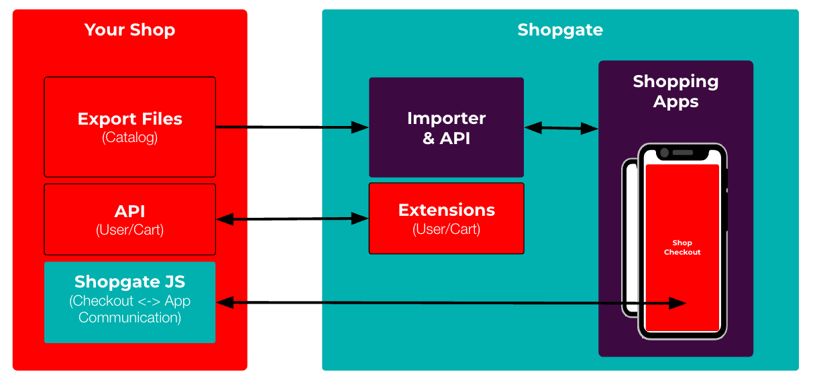

# Checklist: Integrate an E-Commerce Plattform
Please be aware that Shopgate APIs and imports are designed for fair usage. Please use the API responsibly and avoid sending excessive or repetitive requests that could be avoided. We reserve the right to limit or suspend access if unintended usage effects our service for others.   

If you're looking for a guidance which way you should use to i.e. implement the export, please contact our support. We also offer standard integrations for many major e-commerce platforms like Shopify, Shopware or Adobe/Magento.

## Minimum Requirements

In order to allow your customers to browse and buy products inside the app, these steps need to be completed:

### Categories are shown in the app

**Ways of implementation:**

Export of [XML](../../../../references/cart-integration/catalog-data-feed/category-xml.md)  
Full Feature Set, full export files only, one file per language, import max. once per hour

Export of [JSON](https://docs.shopgate.com/docs/retail-red/e7a82d64f96cf-bulk-imports-in-json-format)  
Full Feature Set, full & delta export files, content localization in one file, real-time-updates possible

Export of [CSV](https://docs.shopgate.com/docs/retail-red/91d05f118da29-bulk-file-imports-in-csv-format-via-ftp-or-shopgate-admin#category-csv)  
Limited Feature Set, see documentation for details

Real-time-Updates via [API](https://docs.shopgate.com/docs/retail-red/276d02bcb3751-near-real-time-updates-in-json-format-via-the-shopgate-api)  
Requires JSON export as full import

### Products are shown in the app

**Ways of implementation:**

Export of [XML](../../../../references/cart-integration/catalog-data-feed/product-xml.md)  
Full Feature Set, full files only, one file per local, import max. once per hour

Export of [JSON](https://docs.shopgate.com/docs/retail-red/e7a82d64f96cf-bulk-imports-in-json-format)  
Full Feature Set, full & delta files, content localization in one file, real-time-updates possible

Export of [CSV](https://docs.shopgate.com/docs/retail-red/91d05f118da29-bulk-file-imports-in-csv-format-via-ftp-or-shopgate-admin#product-csv)  
Limited Feature Set, see documentation for details

Real-time-Updates via [API](https://docs.shopgate.com/docs/retail-red/276d02bcb3751-near-real-time-updates-in-json-format-via-the-shopgate-api)  
Requires JSON export as full import

### Basic Web-Checkout Integration  
[Cart and user handling, checkout and app communication](../../webcheckout/overview.md) have been implemented

### Order and Customer endpoints  
Add [TODO endpoints](TODO) that provide required information for Shopgate to update the app dashboard  

## Best App Experience

Our goal is to provide your customers the best possible app experience. Therefore we strongly recommend implementing these features.

### Product reviews are available in the app  
  
**Ways of implementation:** 

Export of [XML](../../../../references/cart-integration/catalog-data-feed/review-xml.md)  
Full Feature Set, full files only, one file per local, import max. once per hour

Third Party Review Source (via Extension)  
In case your reviews are managed by an some third party provider, you can either check for already available integrations with our support team or implement your own extension by overriding/extending the review [pipelines](../../../../../static/pipelines/shopgate-reviews-pipelines.oas2.yml) or [TODOload external/new content](url) inside the app.

### Favorite List Sync  
Allow your customers [favorite list(s)](https://docs.shopgate.com/docs/connect-doc/988df8d7e72a6-tutorial-how-to-perform-an-advanced-ecp-integration#syncing-the-favorites-list) to be in sync with your ecommerce platform. Otherwise they are saved only in the Shopgate system.  

### Profile Pages / Order History etc.  
**Ways of implementation:**  

Link profile pages  
You can [TODO link](url) all kind of pages for logged-in users to your onlineshop pages. The pages are opened inside app webview just like the webcheckout. This is recommended when you have many custom pages but limited ressources to rebuild all of them.   

Build native profile pages    
You can build your own pages for logged-in users inside the app using native frontends like your [profile page & adress book](../../../../tutorials/advanced/ecp-integration.md) or build your own custom frontends with custom pipelines. 

### Allow app only offers
Allow your marketing users to create [TODO app only offers](url) like coupons or automatic discounts inside your e-commerce platform.

## Code Examples

### Webcheckout 
Check our Shopware 6 Webcheckout integration as an example integration:  
Endpoints on shop-side: https://github.com/shopgate/shopware6-webcheckout  
Utilities Extension: TODO  
User Extension: TODO  
Cart Extension: TODO  
Favorites Extension: TODO  
Web-Account Extension: TODO