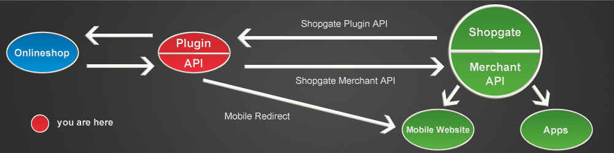
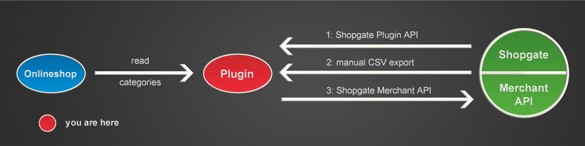
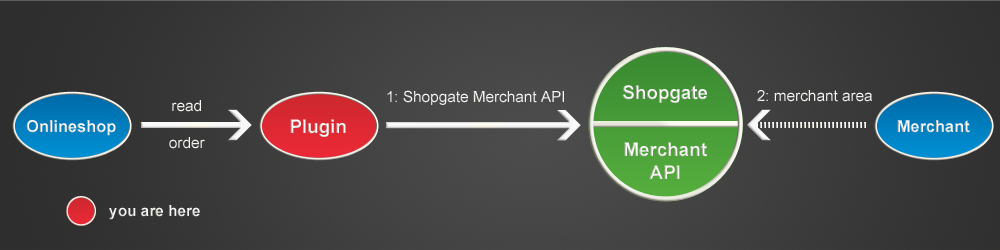
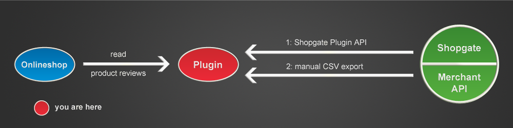
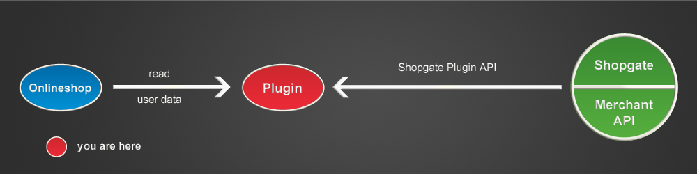
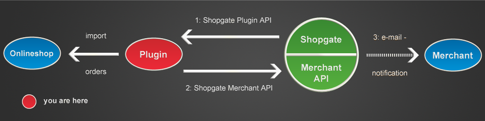
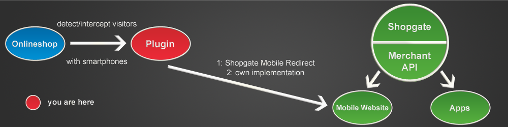

# Full Requirements

## Checklist

The Connection to Shopgate is working correctly when the following can be answered with “yes”:

1. Categories are exported to Shopgate (Milestone [Export categories](#export-of-categories)).
2. Products are exported to Shopgate (Milestone [Export products](#export-of-products)).
3. Product reviews are exported to Shopgate (Milestone [Export product reviews](#export-of-product-reviews)).
4. Users can register via Shopgate Connect (Milestone [Shopgate Connect](#shopgate-connect)).
5. When requesting for data during calls to API, as much data as possible is returned (Special Requirement [Comprehensive Data](#comprehensive-data)).
6. Orders are imported into the online shop (Milestone [Importing orders](#importing-orders)).
7. Orders are imported in full and only saved when all the information is available (Special Requirement [Saving a complete order](#saving-of-complete-orders)).
8. Changes in the status of orders are transferred to Shopgate (Milestone [Order synchronisation](#order-synchronization)).
9. Online shop visitors with mobile devices are automatically redirected (Milestone [Mobile Redirect](#mobile-redirect)).
10. Authentication for the interfaces (Shopgate Merchant API and Shopgate Plugin API) is implemented (Special Requirement [Authentication](#authentication)).
11. Incoming and outgoing queries and errors are logged (Special Requirement [Log files](#log-files)).
12. Detailed error reports are generated and the implementation does not abort in places critical for the shop operations (Special Requirement [Error Handling](#error-handling)).
13. Log files are available via the Shopgate Plugin API (Special Requirement [Retrieval of log files](#retrieval-and-resetting-of-log-files)).
14. System information is available via the Shopgate Plugin API (Special Requirement [Retrieval of System Information](#retrieval-of-system-information)).
15. The implementation can communicate both with the test server and the live server, as well as any development systems, via Shopgate Merchant API (Special Requirement [Test Mode](#test-mode)).

## Overview

## Definition of Terms

- **Online Shop**
This term describes a system directly operated by the merchant. It may be an online shop system but also a wide ERP system, or any other configuration.

- **Plugin**
Extensions for an online shop have different names depending upon the system: plugin, module, extension, app, etc. The extension of an online shop is always referred to as a plugin here.

- **Shopgate Merchant API**
Interface specified and offered by Shopgate for the communication between an online shop and - Shopgate.

- **Shopgate Plugin API**
An interface specified by Shopgate for the communication between an online shop and Shopgate. It must be offered by a plugin.

- **Shopgate Cart Integration SDK**
A PHP library to simplify plugin development. The Shopgate Cart Integration SDK implements the Shopgate Plugin API and contains classes for the communication with the Shopgate Merchant API, the Mobile Redirect and for configuring the Connection to Shopgate.

- **Connection to Shopgate**
The term Connection to Shopgate means general integration of Shopgate with the systems and business processes of a merchant. The plugin is therefore a part of the Connection to Shopgate. In an ideal Connection to Shopgate, the terms plugin and Connection to Shopgate are synonymous.

- **Shopgate Connect**
Shopgate Connect describes a procedure in which final customers can register for the apps or the Mobile Website through their existing accounts in the online shop.

- **App(s)**
Native applications for mobile phone operating systems (iOS, Android, Windows Phone) are referred to in this document as apps.

- **Mobile Website**
The Mobile Website is an internet site optimized for mobile phone and offered by Shopgate to the merchants.

- **Mobile Redirect**
Mobile Redirect is the procedure of automatic detection of visitors using mobile phone and redirecting them to the Mobile Website.

- **Mobile Header**
Mobile Header is a button appearing at the head of an online shop if a visitor has disabled the Mobile Redirect with their mobile phone. The Mobile Redirect function can be re-enabled with this button.

## Target Specifications

Connecting to Shopgate should allow the merchant to use the entire range of Shopgates functions and to offer their products to mobile devices.
Shopgate Inc. offers its customers a Mobile Website and native apps for popular mobile phone operating systems. For this purpose, Shopgate provides its own infrastructure for products and categories as well as management of orders placed through the Mobile Website or apps. If a customer already has an account in a merchants online shop, he or she may log in through the so called Shopgate Connect procedure on the Mobile Website or through an app. A mobile phone visitor on the merchants online shop will automatically be redirected to the Mobile Website.

**Range of functions of a completed Connection to Shopgate:**
- Export of a stock list to Shopgate (category_export, product_export, review_export).
- Import of orders placed via Shopgate into the online shop (Import Orders).
- Synchronization of imported orders (i.e. synchronization of the shipping status) through the Shopgate infrastructure (Update Orders).
- Implementation of the Shopgate Connect procedure (Shopgate Connect).
- Re-direction to the Mobile Website (Mobile Redirect).

There are several possible approaches to the implementation of some of these functions. In the chapter Milestones you will find a more detailed description for every function. Generally, the use of the interfaces specified by Shopgate is recommended: 

- The *Shopgate Plugin API* must be provided by your Connection to Shopgate. It supports export of stock products, import of orders and the Shopgate Connect procedure.
- The *Shopgate Merchant API* is provided by Shopgate and supports order synchronisation, updating of products and partial functions of the Mobile Website redirect functionality.

For PHP implementations, we recommend using the Shopgate Cart Integration SDK, since the special requirements and interfacesare already implemented there.

## Product Use

The Connection to Shopgate is deployed in the online shop environment. The configuration of server systems can vary; therefore, it is important that the Connection to Shopgate runs on common configurations.

## Milestones

Milestones comprise all operations that are directly involved in the data exchange between the concerned online shop and Shopgate. An additional milestone is the automatic redirection of customers with mobile devices to the Mobile Website.

## Export of Categories

> **Ways of implementation**
> 
> **Shopgate Cart Integration SDK:** createCategories()  
> *(recommended)*
> 
> **Shopgate Plugin API:** get_categories  
> *(recommended for Connection to Shopgate without PHP)*
> 
> **Manual export of XML:** Categories XML format  
> *(recommended for closed systems)*
> 
> **Shopgate Merchant API:** add_category, delete_category, update_category  
> *(recommended when updating single categories)*

### Background 

Products are organized in categories within the online shops. Shopgate offers its own infrastructure for products and merchants’ categories that must be synchronized with the online shop. Please note that always all categories have to be exported, not only updated categories!

### Objective 

The category tree of a shop at Shopgate corresponds to the category tree in the online shop of a merchant.

### Procedure

1. Shopgate calls "get_categories" via cron daily (or more often, depending on the agreement with the merchant).
2. Your plugin reads the categories of the online shop and produces a XML file in the Shopgate format.
3. The contents of the XML file are returned.
4. Shopgate imports the categories from the XML file.

### Description

#### Option 1:

When using the Shopgate XML export via Shopgate Plugin API, Shopgate accesses all categories and updates them in regular intervals. We recommend using the Shopgate Cart Integration SDK for PHP implementations of the Shopgate Plugin API.

#### Option 2: 

Access to a XML file can take place without the API, by regularly generating and
updating a XML file that is downloaded by Shopgate. This is an emergency solution to be used when no other options are available. 

#### Option 3:

Only minor changes should be synchronized through the Shopgate Merchant API, i.e. creation, deletion or update of a particular category. A complete export via the API can take a long time so export via XML file is strongly recommended. We recommend using the Shopgate Cart Integration SDK for PHP implementations of the Shopgate Merchant API.

### Vital considerations:

- The field url_deeplink is very important for redirect customers who do not want to use the Mobile Website back to the correct category in the online shop.
- Provide pictures as large as possible for the categories – Shopgate will scale them for you.
- It is necessary to specify a category_number to ensure that customers are redirected to the exact same category on the mobile website.

## Export of Products

> **Ways of implementation**
> 
> **Shopgate Cart Integration SDK:** createItems()  
> *(recommended)*
> 
> **Shopgate Plugin API:** get_items  
> *(recommended for Connection to Shopgate without PHP)*
> 
> **Manual export of XML:** Product XML format  
> *(recommended for closed systems)*
> 
> **Shopgate Merchant API:**  
> add_item, delete_item, update_item  
> *(recommended when updating single products)*

### Background

The online shop contains products offered by merchants. These products must be synchronized with the Shopgate infrastructure in order to appear in the Mobile Website and the native apps as well. Please note that always all products have to be exported, not only updated products!

### Objective

The product offer in Shopgate corresponds to the product offer in the merchants online shop.

### Procedure

1. Shopgate calls "get_items" via cron daily (or more often, depending on the agreement with the merchant).
2. Your plugin reads the products of the online shop and produces a XML file in the Shopgate format.
3. The contents of the XML file are returned.
4. Shopgate imports the products from the XML file.

### Description

#### Option 1:

When using the Shopgate XML export via Shopgate Plugin API, Shopgate accesses all products and updates them in regular intervals. Should the XML file take too long to be created due to a large number of products, the export can also be performed in several smaller steps. If the parameters limit and offset are set in the API call, the number of returned products must not exceed the value in the field limit. Products export must start from the consecutive number indicated in the field offset (incl.). First retrieval always starts at offset 0. We recommend using the Shopgate Cart Integration SDK for PHP implementations of the Shopgate Plugin API.

#### Option 2:

Access to a XML file can take place without the API, by regularly generating and updating a XML file that is downloaded by Shopgate. This is an emergency solution to be used only when no other option is available.

#### Option 3:

Only minor changes should be synchronized through the Shopgate Merchant API, i.e. creation, deletion or update of a particular product. A complete export via the API can take a long time so export via XML file is strongly recommended. We recommend using the Shopgate Cart Integration SDK for PHP implementations of the Shopgate Merchant API.
You will find additional links to individual approaches on the right side, in the “Ways of implementation” box.

### Vital considerations:

- The field url_deeplink is very important in order to redirect customers who do not want to use the Mobile Website back to the correct product page in the online shop.
- You can provide us information about the current stock in the stock field. If this field's value is 0, the product will be disabled.
- Provide pictures of products as large as possible in the field urls_images – Shopgate will scale them for you.
- EAN, ISBN or PZN help the customers to find products quickly through the search function or using the barcode scanner. Product search functionality is essential in the area of mobile shopping.
- To further support keyword searching, specify a lot of matching tags.
- Thematically related articles included in the related_shop_item_numbers field allow Shopgate to present a better overview of the shop's product range to customers. This significantly improves the quality of your offering.

## Export of Product Reviews

> **Ways of implementation**
> 
> **Shopgate Cart Integration SDK:** createReviews()  
> *(recommended)*
> 
> **Shopgate Plugin API:** get_reviews  
> *(recommended for Connection to Shopgate without PHP)*
> 
> **Manual export of XML:** Product reviews XML format  
> *(recommended for closed systems)*

### Background

Online shops offer points and comments based systems for their customers to review products. Please note that always all product reviews have to be exported, not only updated product reviews!

### Objective

The product reviews from the online shop correspond to the product reviews at Shopgate.

### Procedure

1. Shopgate calls "get_items" via cron daily (or more often, depending on the agreement with the merchant).
2. Your plugin reads the reviews of the online shop and produces a XML file in the Shopgate format.
3. The contents of the XML file are returned.
4. Shopgate imports the reviews from the XML file.

### Description

#### Option 1:

When using the Shopgate XML export via Shopgate Plugin API, Shopgate accesses all products and updates them in regular intervals. We recommend using the Shopgate Cart Integration SDK for PHP implementations of the Shopgate Plugin API.

#### Option 2:

Access to a XML file can take place without the API, by regularly generating and updating a XML file that is downloaded by Shopgate. This is an emergency solution to be used only when no other option is available.
You will find additional links to the individual approaches on the right side, in the “Ways of implementation” box.

## Shopgate Connect

> **Ways of implementation**
> 
> **Shopgate Cart Integration SDK:** getCustomer()  
> *(recommended)*
> 
> **Shopgate Plugin API:** get_customer  
> *(recommended for Connection to Shopgate without PHP)*

### Background

Customers who already have an account in an online shop can use it to register in native apps or on the Mobile Website, too.

### Objective

Customers are able to register in the apps and on the Mobile Website using their online shop credentials. The plugin returns the user's details (invoice and delivery addresses etc.) for synchronization Shopgate. Orders placed by a customer who registered via Shopgate Connect are automatically assigned to the customer's user account in the online shop. If the login fails, an error message is returned to Shopgate.

### Procedure

1. The user registers via the app or the Mobile Website using his existing online shop credentials.
2. The user enters login and password.
3. Shopgate calls the action get_customer with the login data.
4. Your plugin tries to authenticate the customer in the online shop.
5. If the authentication succeeds, the module returns the customer's details to
Shopgate.
6. A quick and easy registration of the customer is made possible by using the
customer's details.

### Description

The Shopgate Connect procedure can only be implemented via Shopgate Plugin API. We recommend using the Shopgate Cart Integration SDK for PHP implementations of the Shopgate Plugin API.
You will find additional links to the individual approaches on the right side, in the “Ways of implementation” box.

### Vital considerations:

- Make sure that the default address is returned first as it will also be offered to the customer as the default address. If the customer has to choose the correct address during checkout, that can cause a termination of the process – the checkout procedure should be as quick and comfortable as possible.
- Incoming requests must be logged. While doing so, ensure that the password will be blacked out when the get_customer action is called, in order to provide security for customers. The Shopgate Cart Integration SDK executes the logging and blacks out the password when calling the get_customer action automatically.
- The use of an encrypted SSL connection is a requirement for the use of the Shopgate Connect procedure and in the interest of the customers.

## Registering Customers

> **Ways of implementation**
> 
> **Shopgate Cart Integration SDK:** registerCustomer()  
> *(recommended)*
> 
> **Shopgate Plugin API:** register_customer  
> *(recommended for closed systems)*

### Background

Customers who already have an account in an online shop can use it to register in native apps or on the Mobile Website, too.

## Exporting a Customer's Orders

> **Ways of implementation**
> 
> **Shopgate Cart Integration SDK:** getOrders()  
> *(recommended)*
> 
> **Shopgate Plugin API:** get_orders  
> *(recommended for closed systems)*

### Background

Customers who have their Shopgate account linked to the desktop site should be able to view their orders they placed using the mobile website, apps or desktop site.

## Exporting a Customer's Favourite List

### Background

Customers who have their Shopgate account linked to the desktop site should be able to view and manage their favourite list using the mobile website or apps.

## Live Synchronization of Stock Quantities

> **Ways of implementation**
> 
> **Shopgate Cart Integration SDK:** checkStock()  
> *(recommended)*
> 
> **Shopgate Plugin API:** check_stock  
> *(recommended for closed systems)*

### Background

When customers view a product detail page the stock status of the product and its variations should be synchronized in order to prevent backorders.

## Synchronizing Carts

> **Ways of implementation**
> 
> **Shopgate Cart Integration SDK:** checkCart()  
> *(recommended)*
> 
> **Shopgate Plugin API:** check_cart  
> *(recommended for Connection to Shopgate without PHP)*

### Background

The synchronization of a customer's shopping cart allows real-time validation of coupons, product relations, (e.g. product A can only be bought along with product B) and to calculate price models for shipping and handling during checkout.

> **Note:**
>
> Currently, the synchronization only supports the validation of coupons.

### Objective

Customers receive real-time feedback about the contents of their shopping carts.

### Procedure

1. The customer adds a product to the cart (or: removes a product from the cart, changes quantities, adds a coupon, removes a coupon).
2. Shopgate calls the check_cart action with the contents of the cart.
3. Your plugin validates the contents of the cart and returns a response to the customer according to the result.
4. If the cart is okay, the customer will not receive a message.
5. If the validation is unsuccessful, the customer will receive your returned error message.

### Description

The check_cart action can only be implemented via Shopgate Plugin API. We recommend using the Shopgate Cart Integration SDK for PHP implementations of the Shopgate Plugin API. You will find additional links to the individual approaches on the right side, in the “Ways of implementation” box.

### Vital considerations

- Please note that only "external coupons" can be validated by your plugin. The validation of "Shopgate coupons" will be done by Shopgate.
- Provide a detailed message in the correct language (same as the language for export of products) so the customer knows what went wrong.

## Importing Orders

> **Ways of implementation**
> 
> **Shopgate Cart Integration SDK**: addOrder(), updateOrder()  
> *(recommended)*
> 
> **Shopgate Plugin API**: add_order, update_order  
> *(recommended for Connection to Shopgate without PHP)*
> 
> **Shopgate Merchant API**: get_orders  
> *(commended for closed systems)*
> 
> **Per mail**  
> *(recommended for non-expandable systems)*

### Background

Orders placed via the native apps or the Mobile Website arrive to Shopgate first and are displayed in the merchants administration area. To avoid disturbing the merchants usual procedures these orders should be imported into the online shop. If the customer registered at Shopgate via Shopgate Connect, the order must be assigned to their account. Differing shipping or invoice addresses must be added. For unknown customers a guest account must be created containing the information necessary to process the order.

### Objective

Shopgate informs the merchant about all orders placed. If possible, orders must be imported to the merchants online shop.

### Procedure when using the Shopgate Plugin API

1. An order is received by Shopgate.
2. Shopgate calls add_order and passes the Shopgate order number.
3. Your module calls the get_orders action of the Shopgate Merchant API to receive detailed information about this order.
4. The order is stored into the online shop's database with the received information.
5. a) The customer registered at Shopgate via Shopgate Connect and is known in the online shop: the order is assigned to the customer's account.  
b) The customer is unknown in the online shop: a guest account is created and the order is assigned to this account.
6. The order is cleared for delivery by Shopgate.
7. Shopgate calls update_order with the Shopgate order number and indicates the order field(s) to be updated.
8. Your module calls the get_orders action of the Shopgate Merchant API in order to receive the information for this order number.
9.  The order information is updated in the online shop based on the information received.

*Note: Steps 3 and 7 are not required when using the Shopgate Cart Integration SDK, since the details of an order are retrieved automatically. You only need to process the received information.*

### Procedure when using the Shopgate Merchant API

1. Your plugin is called every day, e.g. via cron.
2. Latest orders are called in from the Shopgate Merchant API with the get_orders action
3. New orders are stored into the system.
4. a) For customers that registered at Shopgate via Shopgate Connect and are known in the online shop: the orders are assigned to the customers' accounts.  
b) For customers unknown in the online shop: guest accounts are created and the orders are assigned to these accounts.
5. Existing orders are updated if necessary.

### Description

#### Option 1:

The Shopgate Plugin API allows orders to be imported promptly with the add_order and update_order actions. They are called within minutes after receiving the order or change of the order status. Furthermore, when updating an order, you can see from the parameters which part of the order needs to be updated. We recommend using the Shopgate Cart Integration SDK for PHP implementations of the Shopgate Plugin API.

#### Option 2:

The Shopgate Merchant API allows the merchant's orders to be retrieved in regular intervals, e.g. with cron jobs. The Shopgate Merchant API implementation should only be chosen when it is not possible to use the Shopgate Plugin API implementation. We recommend using the Shopgate Cart Integration SDK for PHP implementations of the Shopgate Merchant API.

#### Option 3:

If an extension of the online shop is not possible under any circumstances, the merchant can be notified of new orders via e-mail. The merchant should then enter the order into their system and process it accordingly. This is an emergency solution to be used only when no other option is available.

You will find additional links to the individual approaches on the right side, in the “Ways of implementation” box.

### Vital considerations:

- is_shipping_blocked  
If the value of this field is „0”, the order is not blocked for shipping by Shopgate, even if it is not yet marked as “paid”. E.g. in the case of a purchase on account, the order is not marked as paid it but is also not blocked for shipping by Shopgate. Shipping and settlement becomes the merchant's responsibility.

- is_customer_invoice_blocked  
If the value of this field is „1”, an invoice must not be sent to the customer under any circumstances in order to provide an error-free settlement via external service providers (Klarna, BillSAFE). Inside the online shop it must be made perfectly clear that the merchant must not sent an invoice by himself.

- is_paid  
If the value of this field is „1”, the order has been paid. This is only an information for the merchant, shipping does not depend on it.

- is_storno  
If the value of this field is „1”, the order has been cancelled at Shopgate.

- external_customer_number and external_customer_id  
These fields include the customer number and/or ID in the online shop when the customer has previously registered via Shopgate Connect. Orders must be then assigned to this customer's account. If this field is empty, a guest account must be created for the customer. The order must be assigned to that guest account.

- amount_complete  
This is the payment amount that the customer agreed to pay when placing the order. The value stored into the online shop must be exactlythe value given by Shopgate. Do not calculate the price yourself.

- amount_shop_payment and payment_tax_percent  
This field contains costs for the merchants payment method and the tax rate percentage included in the amount. They must be stored as “payment cost” in the order.

- amount_shopgate_payment  
This field includes costs charged by Shopgate to the merchant for their Shopgate payment methods. These costs must not appear in the list of order items, because this amount is withheld by Shopgate and is not included in the final amount of the submitted order.

- payment_infos  
This field includes additional information regarding the settlement. The following chapter “Payment methods” contains further information on processing the payment_infos.

### Payment methods

Shopgate offers several methods of settling payments to merchants that must be presented appropriately in the online shop. The following differences must be considered:

- **Shopgate as a payment method**  
For orders in which the cash flow is settled via Shopgate (i.e. “Shopgate Credit Card”), the payment method “Shopgate” must be implemented.

- **Own payment methods: supported by the online shop**  
All payment methods natively supported by the online shop (i.e. direct debit, invoice, Paypal…) must be properly included into the process of importing a Shopgate order.

- **Own payment methods: not supported by the online shop**  
For payment methods not natively supported by the online shop, information from the payment_infos field in a Shopgate order must be made visible for a merchant in a way commonly used in the online shop , e.g. as comments in the order. The payment method must be called: “Mobile Payment”.

More information for the implementation of the above points specified can be found on the page:. Payment Methods

### Coupons

Shopgate offers a system for merchants to create coupons for campaigns and QR code marketing. By default a coupon has the article number COUPON. Also, coupons always have a negative amount. If a merchant changed the article number of a coupon an article with the same article number has to exist in the online shop. Import of the order item is then the same as on regular order items except this one has a negative amount.

## Order Synchronization

> **Ways of implementation**
> 
> **Shopgate Cart Integration SDK:** Outgoing Requests  
> *(recommended)*
> 
> **Shopgate Merchant API:** add_order_delivery_note,set_order_shipping_completed, cancel_order  
> *(recommended for implementations which do not use PHP)*
> 
> **Merchant Area**  
> *(recommended for non-expandable systems)*

### Background

An order placed via Shopgate will be sent to the customer and may have shipping information appended to it. In order to inform the customers and to transfer payment to the merchant, Shopgate needs to be informed of the following changes in the status of an order:

- order was shipped completely
- order was shipped partially
- a tracking number for the shipping was added
- order was canceled completely
- order was canceled partially

### Objective

Any update of an order's shipment or cancellation information is synchronized to Shopgate's system as well.

### Procedure

Example for shipment of an order:
1. The merchant marks an order as sent in the online shop and provides a tracking number to track the parcel.
2. Your plugin calls the add_order_delivery_note action and transfers the shipping information to Shopgate.
3. Shopgate sends an e-mail with the information to the customer.

Example for cancellation of an order:
1. The merchant marks some items of an order as canceled in the online shop.
2. Your plugin calls the cancel_order action and transfers the information about the canceled items to Shopgate.
3. Shopgate sends an e-mail with the information to the customer.

### Description

#### Option 1:
The Shopgate Merchant API offers two actions to automate the transfer of notifications and additional information to Shopgate: add_order_delivery_note and set_order_shipping_completed. To transfer order cancellations use the action cancel_order. We recommend using the Shopgate Cart Integration SDK for PHP implementations of the Shopgate Merchant API.

#### Option 2:
If no extension of the online shop functionality is possible, the order status can be manually updated in the merchant administration area at Shopgate. This is an emergency solution that may only be used when no other option is available.

You will find additional links to the individual approaches on the right side, in the *“Ways of implementation”* box.

## Synchronization of Settings

> **Ways of implementation**
> 
> **Shopgate Cart Integration SDK**: getSettings()  
> *(recommended)*
> 
> **Shopgate Plugin API: get_settings**  
> *(recommended for closed systems)*

### Background

A shop's specific settings such as countries products are being shipped to, customer groups and setup of taxes must be exported to Shopgate.

## Mobile Redirect

> **Ways of implementation**
> 
> **Shopgate Cart Integration SDK: Shopgate_Helper_Redirect_MobileRedirect**  
> *(recommended)*
> 
> **Shopgate_Helper_Redirect_MobileRedirect Class:**  
> Shopgate_Helper_Redirect_MobileRedirect  
> *(recommended for closed systems)*
> 
> **Own implementation:** Mobile Redirect  
> *(recommended for implementations without PHP)*
> 
> **Retrieval of keywords:**  
> get_mobile_redirect_user_agents  
> *(additional information for own implementations)*

### Background

Guests who visit the online shop website with a mobile phone must be redirected to the Mobile Website to ensure that the contents are presented in the best possible way.

### Objective
A visitor using a mobile device will automatically be redirected from the online shop to the Mobile Website. If they navigated to category or product page, they are transferred to the same category or product page on the Mobile Website. Additional forwarding targets are described in the documents linked in the box “Ways of implementation”. When the visitor returns to the desktop version of the online shop the redirect must be deactivated and at the top of the page the Mobile Header must be shown, i.e. a button allowing the user to reactivate the redirect. Mobile devices are recognized by searching the HTTP header field “user-agent” for certain keywords. These keywords need to be regularly updated through the Shopgate Merchant API.

### Procedure
1. Customers use their mobile phones to find a product in the online shop with a search engine.
2. They click on the link to a product they found.
3. Your plugin recognizes the mobile phone and redirects the customer to the product page of the Mobile Website.
4. The customer decides to return to the desktop version of the online shop.
5. Because of the “shopgate_redirect” GET parameter your plugin recognizes that the customer doesn’t want to be automatically redirected anymore.
6. It sets a cookie to deactivate the redirect and shows the Mobile Header in the top area of the online shop.
7. The customer clicks on the Mobile Header to re-enable the redirect.
8. Your module deletes the cookie that deactivated the redirect and then redirects the customer to the mobile website.

### Description

#### Option 1:
Shopgate Cart Integration SDK offers a class that already implements the redirect for different targets (category, product page, product search, ...), display of the Mobile Header, detection of mobile devices and retrieval of keywords. We therefore recommend using the Shopgate Cart Integration SDK for PHP implementations.

#### Option 2:
The class mentioned in Option 1 class can also be separated from the Shopgate Cart Integration SDK and used independently. In that case the functions for keyword retrieval cannot be used because they rely on other classes of the Shopgate Cart Integration SDK for communication to the Shopgate Merchant API.

#### Option 3:
If your plugin is developed in a language other than PHP, you need to implement the described redirect logic yourself.

You will find additional links to the individual approaches on the right side, in the “Ways of implementation” box.

## Special Requirements
Special requirements must be implemented as framework conditions. Some of the special requirements need to be implemented depending on the way of implementation that was chosen for some of the milestones.

## Support for Multiple Marketplaces

> **Ways of implementation**
> 
> **Shopgate Cart Integration SDK:**  
> *(recommended)*
> 
> **Own implementation:**  
> *(recommended for implementations which do not use PHP)*

### Background
Shop systems usually support multiple languages and currencies for products. At Shopgate multiple languages are represented by multiple shops, i.e. one shop has exactly one language and one currency.

### Objective
To have multiple languages/currencies exported to Shopgate a merchant must be able to configure one marketplace for every language and currency in their online shop.

A configuration for "Marketplace US" then only exports English product descriptions and currency USD to the connected marketplace at Shopgate.

## Authentication

> **Ways of implementation**
> 
> **Shopgate Cart Integration SDK:**  
> *(recommended)*
> 
> **Own implementation:**  
> Shopgate Merchant API, Shopgate Plugin API  
> *(recommended for implementations which do not use PHP)*

### Background
Since the interfaces can be accessed from the internet by everyone an authentication must be implemented to make sure only authorized entities can send requests.

### Objective
The required HTTP headers for authentication are generated and transmitted to the Shopgate Merchant API on every request. On requests to the Shopgate Plugin API the authentication headers get validated. Invalid authentication headers cause an appropriate error message.

### Procedure for queries to Shopgate Plugin API
1. An external action causes a query to be sent to the online shop (e.g. a cron job starts the products export; a customer logs on via Shopgate Connect).
2. Your plugin inspects the HTTP headers required for authentication.
3. When the authentication hash is successfully regenerated and the timestamp of the query is within 30 minutes of the current time, the authentication is successful.
4. The query is then handled by your plugin and an appropriate answer is returned.

### Procedure for queries to Shopgate Merchant API
1. Your plugin sends a query to the Shopgate Merchant API (e.g. get_orders or get_mobile_redirect_keywords).
2. Shopgate checks whether the authentication headers are present and valid.
3. When Shopgate is able to successfully regenerate the authentication hash and the timestamp of the query is within 30 minutes of the current time, the authentication is successful.
4. The query is then handled by Shopgate and an appropriate answer is returned

### Description

#### Option 1:
Use the Shopgate Cart Integration SDK where both the APIs and the authentication are already implemented.

#### Option 2:
If your plugin is developed in a language other than PHP, you have to implement the authentication mechanisms yourself.

You will find additional links to the individual approaches on the right side, in the “Ways of implementation” box.

## Error Handling

> **Ways of implementation**
> 
> **Shopgate Cart Integration SDK**  
> *(recommended)*  
> List of API actions
> 
> **Own implementation**  
> *(recommended for implementations which do not use PHP)*  
> List of API actions

### Background
When processing requests to the Shopgate Plugin API various errors can appear. Technical problems might occur in the online shop, e.g. while saving to or reading from the database. Errors like the Shopgate system trying to add an order twice or more by accident have to be covered as well.

### Objective
When errors occur while calling the Shopgate Plugin API or during other operations within your plugin, they must be logged. On API requests fatal errors (i.e. the requested action cannot be performed or finished) need to be reported back as described in the API specifications.

### Procedure
1. Shopgate calls the “add_order” action and transmits the order number; your plugin processes the call and stores the order into the database of the online shop.
2. A malfunction of the internet connection prevents the answer of the API call from reaching Shopgate.
3. Shopgate then calls the “add_order” action again after 5 minutes, using the same order number.
4. Your module recognizes that the order has already been entered and returns code “60” with the message "duplicate order" according to the specification of the “add_order” action.

### Description

#### Option 1:
Use the Shopgate Cart Integration SDK with the expandable “ShopgateLibraryException” class containing predefined error codes. When throwing a “ShopgateLibraryException”, it gets logged automatically.

#### Option 2:
If your plugin is developed in a language other than PHP, you have to implement the logging and answering error messages to Shopgate Plugin APIs calls yourself.
You will find additional links to the individual approaches on the right side, in the “Ways of implementation” box.

## Log Files

> **Ways of implementation**
> 
> **Shopgate Cart Integration SDK**  
> *(recommended)*
> 
> **Own implementation:**  
> *(recommended for implementations which do not use PHP)*

In order to be able to analyze errors or other irregularities in your plugin it must maintain several log files. Four log file types are required:

- *access* holds information about incoming requests. It contains all the parameters received; passwords (e.g. in get_customer queries) need to be blacked-out.
- *request* holds information about outgoing requests. It contains all transmitted parameters, passwords should be blacked out here as well. (*)
- *error* holds information about encountered errors. It contains the error code, error message and additional information if available.
- *debug* **if requested** holds detailed information, e.g. intermediary steps of complex operations and their results, in order to support debugging.

(*) There is currently no Shopgate Merchant API action that would require a password.

## Vital considerations:
- Every time the parameter "debug_log" with the value "1" is sent alongside a request to the Shopgate Plugin API the debug log must be flushed and intermediary steps of complex operations must be documented in the debug log.
- As this can lead to a vast amount of data the debug log must not be filled when the "debug_log" parameter has not been passed.
- On retrieval of log files through the Shopgate Plugin API the debug log must not be flushed even if the "debug_log" parameter is set.

*Note: The complete logging mechanism is already implemented in the Shopgate Cart Integration SDK . You do not need to create them if you use the SDK.*

## Retrieval and Resetting of Log Files

> **Ways of implementation**
> 
> **Shopgate Cart Integration SDK**  
> *(recommended)*
> 
> **Own implementation:** get_log_file, clear_log_file  
> *(recommended for implementations which do not use PHP)*

### Background
Shopgate requires access to the log files to be able to help merchants when errors occur. To prevent the log files from growing too big there must be a way to delete the content of the files remotely.

### Objective
The plugin implements the "get_log_file" and "clear_log_file" actions specified in the Shopgate Plugin API. On calling "get_log_file" it returns the part of the log file requested. On calling "clear_log_file" the requested file is being reset, i.e. all log entries are removed from the file but the file itself remains.

### Description

#### Option 1:
Use the Shopgate Cart Integration SDK, the "get_log_file" and "clear_log_file" actions are already implemented there.

#### Option 2:
If your plugin is developed in a language other than PHP, you have to implement the "get_log_file" and "clear_log_file" actions according to the specification yourself.

You will find additional links to the individual approaches on the right side, in the *“Ways of implementation”* box.

## Retrieval of System Information

> **Ways of implementation**
> 
> **Shopgate Cart Integration SDK**  
> *(recommended)*
> 
> **Own implementation**: ping  
> *(recommended for implementations which do not use PHP)*

### Background
Information about server configuration, as well as the system used and its settings help us to provide appropriate levels of support for merchants. For the automated integration and the use of Shopgate Connect version information about your plugin is required.

### Objective
The plugin should implement the “ping” action specified in the Shopgate Plugin API and return the required information.

### Description

#### Option 1:
Use the Shopgate Cart Integration SDK, the “ping” action is already implemented there.

#### Option 2:
If your plugin is developed in a language other than PHP, you have to implement the “ping” action according to the specification yourself.

You will find additional links to the individual approaches on the right side, in the “Ways of implementation” box.

## Test Mode

### Background
Before deploying your plugin in a production environment it needs to pass certain tests. To perform testing operations the communication and Mobile Redirect must be configurable to point to a Shopgate test system.

### Objective
The plugin supports three options to set the URL for communication with the Shopgate Merchant API:

- The live setting points to Shopgate's production environment.
- The playground setting points to Shopgate's former test environment.
- The custom setting points to a user-defined URL.

### Description

#### Option 1:
Use the Shopgate Cart Integration SDK. The included configuration class already
contains the settings for different API targets that are used by the API and Mobile Redirect classes.

#### Option 2:
If your plugin is developed in a language other than PHP, you have to implement the settings for different API and Mobile Redirect targets yourself.

**Notes for your own implementation:**

The Shopgate Merchant API is provided under the following URL:

- https://api.shopgate.com/merchant
- Custom: Don't forget to add an input field to specify the custom URL if that option was chosen.

In the case of Mobile Redirect the alias is the sub domain name of the associated Shopgate URL:

- shopgate.com  
Example: http://my-shop.shopgate.com

## Saving of Complete Orders

### Background
Synchronization of stock amounts between a merchant's online shop and the Shopgate infrastructure cannot be guaranteed. Moreover, it cannot be guaranteed that all functions of an online shop can be mapped to functions of Shopgate's system. Such discrepancies may not cause the import of orders to fail.

### Objective
Orders placed via Shopgate always get imported into the online shop entirely.

### Description
Discrepancies between the incoming order (add_order / update_order) and the online shop must be noted clearly visible for the merchant, e.g. in the comments to the order. Only technical problems, e.g. problems with the database connection, need to be reported to Shopgate.

### Examples
Possible discrepancies include:
- Due to the delayed export of products via XML, the desired article is no longer available in the shop.
- A minimum order amount is currently not supported in the Shopgate infrastructure, but several online shops support this function.

## Comprehensive Data

### Background
Data queried from the online shop by Shopgate must be as complete as possible.

### Objective
Customers and visitors of the mobile shop can be provided with detailed and comprehensive information.

### Description
**When exporting data:**  
When exporting products, all relevant descriptions of the products must be returned. Links to the largest pictures available for a product or a category must be exported, as well as all pictures for a product or a category. Product or category tags should be used so that Shopgate can optimize the Mobile Website and apps for search purposes.

**With Shopgate Connect:**  
When using Shopgate Connect, an address needs to be returned so that the customer can register as quickly and comfortably as possible. By doing so the checkout process will not be interrupted by unnecessary inputs that might lead a customer to abort the checkout process.

## Quality Requirements
The quality requirements cover non-functional requirements for the Connection to Shopgate. Your implementation must basically comply with the requirements to receive a certification for your plugin.

## Coding Standards

### Background
To get a certification for your implementation, your code must be well readable. Coding standards ensure the readability and a unified structure of code. Shopgate recommends the use of coding standards for non-certified plugins as well.

### Objective
The source code of your implementation is formatted according to coding standards defined for the used language.

### Description
Apply the following coding standards in order to fulfil Shopgates quality requirements for a Connection to Shopgate:

- PHP: Coding Standards
- Java: Oracle Code Conventions for the Java Programming Language
- If your implementation is based on a different language, please contact us to discuss suitable coding standards.

The following rules apply for identifiers of classes, methods / functions, constants and variables:

- Identifiers must be named in English.
- Identifiers must have descriptive names.
- Identifiers must be clean of pre- and postfixes, e.g. company names.
- Exception: In the global context, the prefix “Shopgate” (for classes), “SHOPGATE_” (for constants) or “shopgate” (for variables and functions) should be prepended to avoid collisions.

## Comment

### Background
Well-commented code is easy to maintain and explains complex operations. Using pre-defined doc comment formats provide the automated creation of a documentation.

### Objective
The source code of your implementation is thoroughly commented and therefore easy to understand.

### Description
Comment the following:
- Complex relations, split into individual methods if necessary.
- Operations specific to the online shop. Remember, that many “standard” operations are executed in very different manner on various systems. Processes that look like trivial logic to you may be difficult to understand for people not familiar with a particular system.
- Provide annotations for your methods, e.g. in JavaDoc or PHPDoc style. This allows documentations to be composed automatically.

All comments must be in English.

## Source Code

### Background
The source code must be analyzed before a Connection to Shopgate can be certified.

### Objective
Connection quality is insured by an analysis of the source code. The analysis is performed by Shopgate.

### Description
Make the source code for your project available to Shopgate. It is not necessary to publish the project as “Open Source”. The source code needs to be made available to Shopgate for the purposes of quality assurance only.

## Certification
To acquire a seal of quality for your implementation you can submit it to Shopgate for certification. Read more about the certification process on [here]().

## Frequent Errors

### General
- Your Connection to Shopgate works correctly only with specific systems (i.e. only works with Linux servers).
- Shopgate Plugin API replies are not converted into UTF-8.
- Shopgate Merchant API replies are not converted into the online shops encoding system.
- Sensitive user data is saved in error or access protocols.
- The Connection to Shopgate breaks down on a critical stage, rendering the online shop inoperable.  
*Example:* When the Mobile Redirect comes down with an error it will tear down the whole online shop with it since the forwarding module must be included before every other output.

### PHP
- The use of short open tags can cause problems on some servers.
- Sometimes PHP functions change their behaviour in new versions.  
*Example:* The function call_user_func_array() can take function return values as argument only since version 5.3.0 or higher.
- Modules that are activated by default are disabled on a particular server crash the Connection to Shopgate.  
*Example:* The functions json_decode() and json_encode() are compiled by default starting from PHP 5.2. Some hosting services still deactivate them, though.

### Order Processing
- A new order is stored in the online shops database. Order processing crashes during this procedure due to an error. That results in an incomplete order present in the system.
- A field different from is_shipping_blocked is used to determine whether an order can be processed by the merchant or is still blocked by Shopgate.  
*Example:* Fields is_paid or is_shipping_completed are mistaken responsible for this purpose. While the is_paid field only contains information for the merchant and is independent from the shipping readiness, the is_shipping_completed field holds on information whether the order has already been processed and sent to the customer by the merchant.

## Shop Interface Certification
If you have implemented your own interface and would like to make it available to the Shopgate community, you should have it certified by Shopgate. After a detailed examination of your interfaces source code you will receive a Shopgate certificate and your shop will be advertised by Shopgate.

### Requirements
What requirements does your interface need to fulfill in order to receive a Shopgate certification?

1. **Be the first!** Only the first shop system interface meeting all the requirements receives a Shopgate certificate. When introducing new requirements, we will keep you as a certified entity or an applicant for the certificate, updated.

2. **Completeness** Meet all the requirements. Interfaces need to meet all the requirements to receive the Shopgate certificate.

### Tips
- **Keep in contact with us** Perhaps an interface for a given system is already nearing completion. We can inform you whether it is worth it to start working on a new one.
- **Write in an easily manageable way** Requirements are increasing as the market develops: Shopgate APIs are constantly being developed and enhanced with new functions. Plan your architecture in a way that enables you to quickly implement these enhancements.
- **Allow us to help you** The Shopgate Cart Integration SDK already contains many basic functions delivered to you in a ready-made state with Shopgate responsible for the maintenance. If your interface uses PHP, it is the easiest way to ensure that it works properly.

### Contact
You can contact our Technical Team via e-mail at:

[support@shopgate.com](mailto:support@shopgate.com)

We will then test your shop interface. If all requirements are met, nothing will prevent you from receiving the Shopgate certificate!
