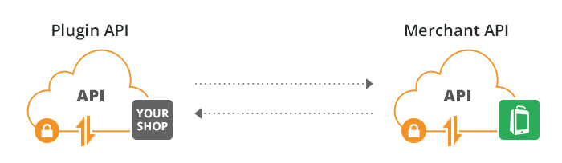

# Quickstart


 To connect your shop with us all you need to
 do is implement our unified Plugin API
 actions that are called from Shopgate.

Follow these four simple steps to connect your shop.

 


## Step 1 - Shopgate Cart Integration SDK


 Create an empty software project, download
 and extract our latest [Cart Integration SDK
 on
 GitHub](https://github.com/shopgate/cart-integration-sdk/releases/latest) 


 ## Step 2 - Include and extend the Cart Integration SDK
 

 You need to create a `plugin.php` that
 includes the Cart Integration SDK and
 extends the Plugin API class
 `ShopgatePlugin`. This forces you to
 implement predefined abstract methods, that
 are called automatically from Shopgate on
 certain actions.

```php
<?php
require_once(dirname(__FILE__).'/shopgate-cart-integration-sdk/shopgate.php');

class ShopgatePluginMyShoppingSystem extends ShopgatePlugin {
  public function startup() {
		$configuration = new ShopgateConfig();
		$configuration->setShopNumber(12345);
		$configuration->setCustomerNumber(54321);
		$configuration->setApikey('56b1dbae2696a');
		$this->config = $configuration;
	}
	...
}
```

>**Plugin authentication**
>
>To authenticate the request you need to
>set your shop number, customer number, and
>api key provided by Shopgate. This needs
>to be done in method startup while
>creating the instance of the object
>`ShopgateConfig` as shown above.

>**Implement abstract methods**
>
>If you are using an IDE like PHPStorm,
>those method stubs are generated
>automatically when you extend the existing
>class `ShopgatePlugin`.

## Step 3 - Create an API endpoint


 Create a PHP file in the your web root to
 define the API endpoint that needs to be
 callable from Shopgate.

 Include and invoke the class created in the
 previous step and pass the `$REQUEST`
 superglobal to the method `handleRequest`.
 The Cart Integration SDK
 handles the request from Shopgate, does
 the authentication, routes the actions,
 creates the data objects, and passes them
 to the method skeletons created one step
 above.*

```php
<?php

 require_once(dirname(__FILE__).'/plugin.php');


 define('SHOPGATE_DEBUG', 1); // important
 for development, please remove when used
 live


 $plugin = new
 ShopgatePluginMyShoppingSystem();

 $plugin->handleRequest($_REQUEST);
 ```

>**SHOPGATE DEBUG**
>
>In an live environment Shopgate is
>generating an authorization token to send
>with each request. The validity of the
>token is verified inside of the SDK based
>on shop number, customer number and API
>key set in configuration one step above.
>It's valid for 60 minutes only, so for
>development it should be skipped, defining
>the constant as shown in the example
>above.


## Step 4 - Test your interface


 You can use any post client like
 [Postman](https://www.getpostman.com/) to
 test your interface.


 For a simple ping request to test your
 interface, you just need to send 4 parameters
 to your API endpoint.

 For example:
 `http://myshoppingsystem.localhost.com/api.php`

 * `action`: ping

 * `shop_number`: 12345

 * `customer_nuber`: 54321

 * `apikey`: 56b1dbae2696a
