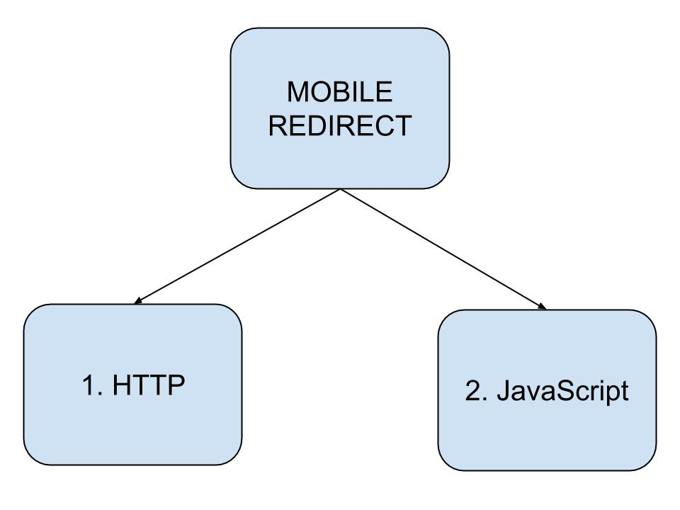
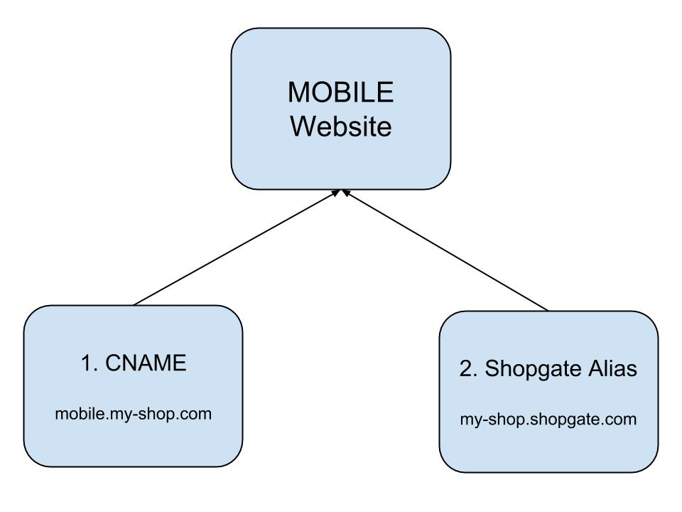
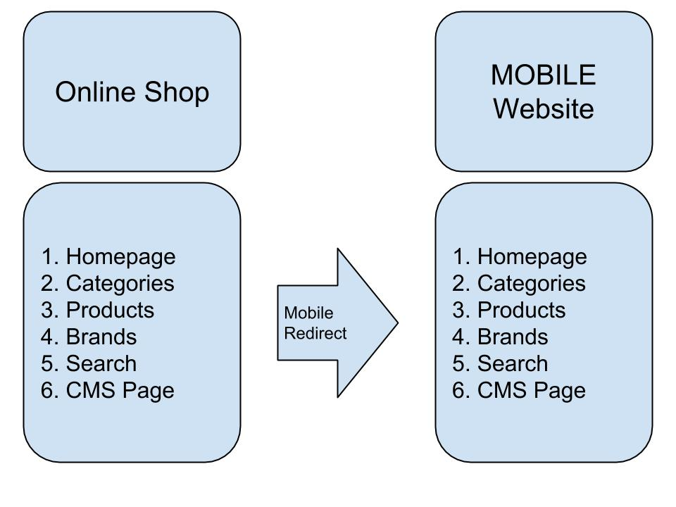

# Mobile Redirect

 1. The Mobile Redirect functionality is already
 implemented into our plugins. The documentation
 below is intended for developers and merchants who
 need to implement their own redirect functionality
 into their shop systems.

 2. The
 [Shopgate_Helper_Redirect_MobileRedirect](cart-integration-sdk.md#Shopgate_Helper_Redirect_MobileRedirect)
 class offers the quickest and most convenient way
 to implement the subjects listed in the
 "Redirecting with the HTTP Header" chapter in PHP.


 ## HTTP or JavaScript

 We offer two options to implement a mobile
 redirect function:



1. **Using HTTP (suggested):**

 It is recommended to redirect using a HTTP header,
 as this also ensures that the Mobile Website will
 be correctly indexed by search engines.

 2. **Using JavaScript (alternative):**

 The Mobile Redirect functionality should only be
 implemented with JavaScript when you cannot modify
 outgoing HTTP headers, e.g. because the server
 configuration does not allow this.

 In both cases a visitor using a mobile device will
 automatically be redirected from the online shop
 to the belonging Mobile Website. If they had
 navigated to a category or product page, they must
 be forwarded to the same category or product page
 on the Mobile Website. Additional forwarding
 targets are described below.

 In case the visitor returns to the desktop version
 of the online shop, the redirect must be
 deactivated and the Mobile Header must be
 displayed on top of the page, i.e. a button
 allowing the user to reactivate the redirect.
 Mobile devices should be recognized via the search
 for keywords in the HTTP header field
 “User-Agent”. These keywords need to be regularly
 updated through the Shopgate Merchant API.


 ## Redirecting using the HTTP Header


 It is recommended to use the
 [Shopgate_Helper_Redirect_MobileRedirect](cart-integration-sdk.md#Shopgate_Helper_Redirect_MobileRedirect)
 class from the Shopgate Library when implementing
 the redirect functionality using the HTTP header
 in PHP.


 ### Redirecting Targets

 The Mobile Website can either be reached with its
 Shopgate Alias or via a CNAME record:



Both must be provided and available in your
 Connection to Shopgate. If a CNAME record is
 available, it will be preferred over the alias.
 The alias in this context here refers to the
 shopgate.com sub domain where the Mobile Website
 is located.


 **Example**:

 <br>If the alias is “my-shop”, the address for
 redirecting is `http://my-shop.shopgate.com`


 ### Redirecting Types

 The redirect functionality needs to reflect the
 various areas of an online shop. For instance, a
 customer who finds a product with a search engine
 on his mobile phone needs to be redirected to the
 same product on the Mobile Website:




The product and category number is converted into
 a hexadecimal byte form for transfer. The
 conversion must be performed exactly as in the PHP
 implementation of the
 [bin2hex()](http://php.net/manual/de/function.bin2hex.php)
 function. Other strings will also be coded for
 transfer (Exception: since no umlauts or special
 characters are allowed for CMS pages anyway, they
 will be transferred without any changes). The
 conversion must be performed exactly as in the PHP
 implementation of the
 [urlencode()](http://php.net/manual/de/function.urlencode.php)
 function.


 The implementation of the Mobile Redirect needs to
 support the following redirect types:


1.**Redirecting to Homepage**
 <br>Redirecting from the online shop homepage to
 the Mobile Website homepage.

 No changes to the URL are required for this
 redirect type.
 <br>Example: `http://my-shop.shopgate.com`

2.**Redirecting to Categories**
 <br>Redirecting from a category of the online shop
 to the same category of the Mobile Website.

 The string appended to the URL consists of:
 '/category/'.bin2hex($categoryNumber)
 <br>Example for the category number 248:
 `http://my-shop.shopgate.com/category/323438`

3.**Redirecting to Products**
 <br>Redirecting from a product of the online shop
 to the same product of the Mobile Website.

 The string appended to the URL consists of:
 '/item/'.bin2hex($productNumber)
 <br>Example for the product number 18262:
 `http://my-shop.shopgate.com/item/3138323632`

4.**Redirecting to Brands**
 <br>Redirecting from products of a given brand to
 the same brand view of the Mobile Website.

 The string appended to the URL consists of:
 '/search/?brand='.urlencode($brandName)
 <br>Example for the “L’Oréal” brand:
 `http://my-shop.shopgate.com/search/?brand=L%E2%80%99Or%C3%A9al`

5.**Redirecting to Search**
 <br>Redirecting from a search query of the online
 shop to a search with the same search term of the
 Mobile Website.

 The string appended to the URL consists of:
 '/search/?s='.urlencode($searchString)
 <br>Example for a search for “detergents”:
 http://my-shop.shopgate.com/search/?s=L%C3%B6sungsmittel

6.**Redirecting to CMS Page**
 <br>Redirecting to a page defined and created by
 the merchant inside the Mobile Website. They
 receive an unique “internal identification” set in
 the merchant area.

 The string appended to the URL consists of:
 '/cms/'.$internalName
 <br>Example for a CMS page with internal
 identification “news”:
 `http://my-shop.shopgate.com/cms/news`


 ### HTTP Header


 The redirect functionality is executed through the
 following HTTP header:

 - HTTP/1.1 301 Found

 - Location: http://my-shop.shopgate.com
 <br>The *http://my-shop.shopgate.com* address must
 be replaced by a redirect address appropriate for
 the CNAME or the alias and the redirect type.


 ### Recognizing Mobile Devices


 Mobile devices are recognized with their
 “User-Agent” header. There is a white list and a
 blacklist of keywords for this purpose which can
 be retrieved through the Shopgate Merchant API. If
 a word from the User-Agent header is found on the
 white list, the redirect function will be
 activated, unless the word is also present on the
 blacklist. This allows, for instance, to redirect
 all “Galaxy” devices, while making exceptions for
 certain models, e.g. “Galaxy Tabs” when required.


 Keyword retrieval via the Shopgate Merchant API is
 implemented by the get_mobile_redirect_user_agents action. 


 ## Redirecting using JavaScript

 If you can’t affect the HTTP headers in your shop
 system you can use the JavaScript Mobile Header to
 automatically redirect your customers with an
 appropriate mobile phone from your shop’s normal
 website to the Mobile Website. In order to do that
 you only need to include the JavaScript code below
 in your online shop. Depending on the
 configuration, the customer will be redirected to
 your shop’s homepage or to a detail view of an
 item.


 ### Redirecting Parameters


 The following chapters contain samples of the
 Mobile Header code for various redirect types. You
 can change their behavior with various parameters.
 Insert each of them in the `var _shopgate = {};`
 line in the following format:

```javascript
// Redirecting Parameters
_shopgate = {
	parameter_name_1: "parameter_value_1",
	parameter_name_2: "parameter_value_2"
};
```

Empty parameters will be ignored. 

### Redirecting Types


#### Redirecting to Homepage

 Copy the following code into your online shop
 between the `<head>` and `</head>` html tags in
 order to activate redirecting to your Mobile
 Website’s homepage.


```html
<!-- BEGIN SHOPGATE MOBILE HEADER CODE -->
 <script type="text/javascript">
 var _shopgate = {
    shop_number: '{SHOPNUMBER}',
    redirect: 'start'
 };

 (function(b,d){
    var a=("undefined"!==typeof _shopgate?_shopgate:{}).shop_number,
    e="http:"===b.location.protocol?"http:":"https:";if(a){var c=b.createElement(d);
    c.async=!/(ip(ad|od|hone)|Android)/i.test(navigator.userAgent);
    c.src=e+"//static.shopgate.com/mobile_header/"+a+".js";
    a=b.getElementsByTagName(d)[0];a.parentNode.insertBefore(c,a)}}
 )(document,"script");
 </script>
 <!-- END SHOPGATE MOBILE HEADER CODE -->
 ```

 #### Obligatory parameters:

 * `_shopgate.shop_number`: This parameter
 identifies your shop in the web app. Its value
 corresponds to the shop number assigned to you by
 Shopgate.
 <br><br>Example: _shopgate.shop_number = "10001";

 * `_shopgate.redirect`: This parameter specifies
 the redirect type. In this case it needs to be set
 to start.
 <br><br>Example: _shopgate.redirect = "start";


 ### Redirecting to Categories

 Copy the following code into your online shop
 between the `<head>` and `</head>` html tags in
 order to activate redirecting to a product
 category on your mobile website. 

```html
<!-- BEGIN SHOPGATE MOBILE HEADER CODE -->
 <script type="text/javascript">
 var _shopgate = {
    shop_number: "{SHOPNUMBER}",
    redirect: "category",
    category_number: "{CATEGORY_NUMBER}"
 };

 (function(b,d){
    var a=("undefined"!==typeof _shopgate?_shopgate:{}).shop_number,
    e="http:"===b.location.protocol?"http:":"https:";if(a){var c=b.createElement(d);
    c.async=!/(ip(ad|od|hone)|Android)/i.test(navigator.userAgent);
    c.src=e+"//static.shopgate.com/mobile_header/"+a+".js";
    a=b.getElementsByTagName(d)[0];a.parentNode.insertBefore(c,a)}}
    )(document,"script");
 </script>
 <!-- END SHOPGATE MOBILE HEADER CODE -->
```

>**Note:**
>
>The string `{CATEGORY_NUMBER}` should be
>replaced with the category number assigned at
>Shopgate to a given category. If this field is
>left empty (i.e. contains only two quotation
>marks ""), you will be redirected to the shop
>homepage.


#### Obligatory parameters:

 * `_shopgate.shop_number`: This parameter
 identifies your shop in the web app. Its value
 corresponds to the shop number assigned to you by
 Shopgate.
 <br><br>Example: _shopgate.shop_number = "10001";

 * `_shopgate.redirect`: This parameter specifies
 the redirect type. In this case it needs to be set
 to category.
 <br><br>Example: _shopgate.redirect = "category";

 * `_shopgate.category_number`: This parameter
 specifies the product category to be redirected
 to. Its value should be the category number
 assigned by Shopgate to each category.
 <br><br>Example: _shopgate.category_number =
 "ABC-123";


 ### Redirecting to Products


 Copy the following code into your online shop
 between the `<head>` and `</head>` html tags in
 order to activate redirecting to a product details
 page on your mobile website.


>**Note:**
>
>The string `{ITEM_NUMBER}` should be replaced
>with the item number assigned at Shopgate to a
>given product. If this field is left empty (i.e.
>contains only two quotation marks ""), you will
>be redirected to the shop homepage.

```html
<!-- BEGIN SHOPGATE MOBILE HEADER CODE -->
 <script type="text/javascript">
 var _shopgate = {
    shop_number: "{SHOPNUMBER}",
    redirect: "item",
    item_number: "{ITEM_NUMBER}"
 };

 (function(b,d){
    var a=("undefined"!==typeof _shopgate?_shopgate:{}).shop_number,
    e="http:"===b.location.protocol?"http:":"https:";if(a){var c=b.createElement(d);
    c.async=!/(ip(ad|od|hone)|Android)/i.test(navigator.userAgent);
    c.src=e+"//static.shopgate.com/mobile_header/"+a+".js";
    a=b.getElementsByTagName(d)[0];a.parentNode.insertBefore(c,a)}}
 )(document,"script");
 </script>
 <!-- END SHOPGATE MOBILE HEADER CODE -->
 ```

#### Obligatory parameters:

 * `_shopgate.shop_number`: This parameter
 identifies your shop in the web app. Its value
 corresponds to the shop number assigned to you by
 Shopgate.
 <br><br>Example: _shopgate.shop_number = "10001";

 * `_shopgate.redirect`: This parameter specifies
 the redirect type. In this case it needs to be set
 to item.
 <br><br>Example: _shopgate.redirect = "item";

 * `_shopgate.item_number`: This parameter
 specifies the item page that the function should
 redirect to. Its value should be the item number
 assigned by Shopgate to every item in the shop. If
 this parameter is empty, you will be redirected to
 the shop homepage.
 <br><br>Example: _shopgate.item_number =
 "ABC-123";


 ### Redirecting to Brand


 Copy the following code into your online shop
 between the `<head>` and `</head>` html tags in
 order to activate redirecting to search for
 brands.

>**Note.**
>
>The `{BRAND}` string needs to be replaced by the
>appropriate brand name.

```html
<!-- BEGIN SHOPGATE MOBILE HEADER CODE -->
 <script type="text/javascript">
    var _shopgate = {
    shop_number: "{SHOPNUMBER}",
    redirect: "brand",
    brand_name: "{BRAND}"
 };

 (function(b,d){
    var a=("undefined"!==typeof _shopgate?_shopgate:{}).shop_number,
    e="http:"===b.location.protocol?"http:":"https:";if(a){var c=b.createElement(d);
    c.async=!/(ip(ad|od|hone)|Android)/i.test(navigator.userAgent);
    c.src=e+"//static.shopgate.com/mobile_header/"+a+".js";
    a=b.getElementsByTagName(d)[0];a.parentNode.insertBefore(c,a)}}
    )(document,"script");
 </script>
 <!-- END SHOPGATE MOBILE HEADER CODE -->
 ```

#### Obligatory parameters:

 * `_shopgate.shop_number`: This parameter
 identifies your shop in the web app. Its value
 corresponds to the shop number assigned to you by
 Shopgate.
 <br><br>Example: _shopgate.shop_number = "10001";

 * `_shopgate.redirect`: This parameter specifies
 the redirect type. In this case it needs to be set
 to brand.
 <br><br>Example: _shopgate.redirect = "brand";

 * `_shopgate.brand_name`: This parameter lets you
 specify the brand name that you are looking for.
 <br><br>Example: _shopgate.brand_name = "Samsung";


 ### Redirecting to Search

 Copy the following code into your online shop
 between the `<head>` and `</head>` html tags in
 order to activate redirecting to the search

>**Note:**
>
>The `{SEARCH_TERM}` string needs to be replaced
>by an appropriate search term.

```html
<!-- BEGIN SHOPGATE MOBILE HEADER CODE -->
 <script type="text/javascript">
 var _shopgate = {
    shop_number: "{SHOPNUMBER}",
    redirect: "search",
    search_query: "{SEARCH_TERM}"
 };

 (function(b,d){
    var a=("undefined"!==typeof _shopgate?_shopgate:{}).shop_number,
    e="http:"===b.location.protocol?"http:":"https:";if(a){var c=b.createElement(d);
    c.async=!/(ip(ad|od|hone)|Android)/i.test(navigator.userAgent);
    c.src=e+"//static.shopgate.com/mobile_header/"+a+".js";
    a=b.getElementsByTagName(d)[0];a.parentNode.insertBefore(c,a)}}
 )(document,"script");
 </script>
 <!-- END SHOPGATE MOBILE HEADER CODE -->
```

#### Obligatory parameters:

 * `_shopgate.shop_number`: This parameter
 identifies your shop in the web app. Its value
 corresponds to the shop number assigned to you by
 Shopgate.
 <br><br>Example: _shopgate.shop_number = "10001";

 * `_shopgate.redirect`: This parameter specifies
 the redirect type. In this case it needs to be set
 to search.
 <br><br>Example: _shopgate.redirect = "search";

 * `_shopgate.search_query`: This parameter lets
 you specify the search query.
 <br><br>Example: _shopgate.search_query = "LCD
 TV";


 ### Redirecting to CMS Page

 Copy the following code into your online shop
 between the `<head>` and `</head>` html tags in
 order to activate redirecting to a CMS page.

 >**Note:**
 >
 >You need to replace the name of the CMS page
 >(here: `{INTERNAL_IDENTIFICATION}`) with the
 >“internal identification” of your desired page.
 >If this field is left empty (i.e. contains only
 >two quotation marks ""), you will be redirected
 >to the shop homepage.


```html
<!-- BEGIN SHOPGATE MOBILE HEADER CODE -->
 <script type="text/javascript">
    var _shopgate = {
    shop_number: "{SHOPNUMBER}",
    redirect: "cms",
    cms_page: "{INTERNAL_IDENTIFICATION}"
 };

 (function(b,d){
    var a=("undefined"!==typeof _shopgate?_shopgate:{}).shop_number,
    e="http:"===b.location.protocol?"http:":"https:";if(a){var c=b.createElement(d);
    c.async=!/(ip(ad|od|hone)|Android)/i.test(navigator.userAgent);
    c.src=e+"//static.shopgate.com/mobile_header/"+a+".js";
    a=b.getElementsByTagName(d)[0];a.parentNode.insertBefore(c,a)}}
 )(document,"script");
 </script>
 <!-- END SHOPGATE MOBILE HEADER CODE -->
 ```

#### Obligatory parameters:

 * `_shopgate.shop_number`: This parameter
 identifies your shop in the web app. Its value
 corresponds to the shop number assigned to you by
 Shopgate.
 <br><br>Example: _shopgate.shop_number = "10001";

 * `_shopgate.redirect`: This parameter specifies
 the redirect type. In this case it needs to be set
 to cms.
 <br><br>Example: _shopgate.redirect = "cms";

 * `_shopgate.cms_page`: This parameter specifies
 the CMS page to be redirected to. Its value should
 be the “internal identification” of an item from
 the CMS management tab.
 <br><br>Example: _shopgate.cms_page = "FAQ";


 ### Other Redirect Options

 This type can be used for all the remaining pages
 within your online shop that do not fit any of the
 previously mentioned redirect methods. For
 instance, customers who reach one of these pages
 via Google are currently redirected to your
 homepage. We analyze both the originating
 addresses and the values of the `_shopgate`
 parameter array, so we can implement special
 redirects in separate areas of the Mobile Website,
 when required. Copy the following code into your
 online shop between the `<head>` and `</head>`
 html tags.

```html
<!-- BEGIN SHOPGATE MOBILE HEADER CODE -->
 <script type="text/javascript">
    var _shopgate = {
    shop_number: "{SHOPNUMBER}",
    redirect: "redirect_from_webshop"
 };

 (function(b,d){
    var a=("undefined"!==typeof _shopgate?_shopgate:{}).shop_number,
    e="http:"===b.location.protocol?"http:":"https:";if(a){var c=b.createElement(d);
    c.async=!/(ip(ad|od|hone)|Android)/i.test(navigator.userAgent);
    c.src=e+"//static.shopgate.com/mobile_header/"+a+".js";
    a=b.getElementsByTagName(d)[0];a.parentNode.insertBefore(c,a)}}
 )(document,"script");
 </script>
 <!-- END SHOPGATE MOBILE HEADER CODE -->
 ```

#### Obligatory parameters:

 * `_shopgate.shop_number`: This parameter
 identifies your shop in the web app. Its value
 corresponds to the shop number assigned to you by
 Shopgate.
 <br><br>Example: _shopgate.shop_number = "10001";

 * `_shopgate.redirect`: This parameter specifies
 the redirect type. In this case it needs to be set
 to redirect_from_webshop.
 <br><br>Example: _shopgate.redirect =
 "redirect_from_webshop";


 #### Optional Parameters

 * `_shopgate.css_selector`: Visitors who have deactivated the Mobile Website on their mobile phones will see a button with which they can reactivate it. Usually the Mobile Header inserts it into your html code directly after the `<body>` element. In some instances this can lead to display problems. This parameter allows you to specify where to display the button in your html document. Example: _shopgate.css_selector = "div.content_wrapper div.content";


 * `_shopgate.is_mobile_button_disabled`: If the
 value of this variable is true, the button
 redirecting to the Mobile Website is hidden.
 <br><br>Example:
 _shopgate.is_mobile_button_disabled = true;
