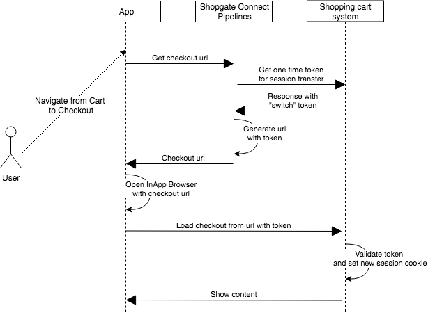

## Basic Webcheckout integration

 The integration is based on two different parts:

 * Web Checkout API

 * Seamless Integration of the Shop System Checkout

 ### Web Checkout API

 The Web Checkout API is an API on the shop system side
 which provides necessary functionalities to use the
 Shopgate Connect Web Checkout. 

 These functionalities are divided into four parts:

 * Authentication

 * Cart management

 * User management

 * Checkout

 #### Authentication

 Authentication secures the communication between
 Shopgate Connect and the shop system. Shopgate Connect
 supports two different authentication methods:

 1. Basic Authentication (Username and Password)

 2. OAuth2 (Client Credentials)

 The Web Checkout API therefore needs the following
 action in case of the OAuth2 method:

 - **Authenticate** provides an OAuth2 access token for
 Shopgate Connect to authenticate against the Web
 Checkout API. 
 
 >**Note:**
 >
 > This process does not apply to communication between the app and the shop system.

 #### Cart Management

 As the name implies, cart management is responsible
 for creating, getting, updating, and deleting the cart
 or single cart items. The following list describes these
 actions briefly:

 - **Create cart** creates a new cart and returns its
 cart ID for later cart management.

 - **Get cart** returns the cart for a given cart ID.

 - **Adding product(s) to the cart** adds at least one
 product to the given cart.

 - **Adding coupon(s) to the cart** adds at least one
 coupon to the given cart.

 - **Update quantity of product(s) within the cart**
 updates the quantity of at least one product within the cart.
 

 - **Remove cart items from the cart** removes at least
 one cart item (coupon or product).

 > **Note**: 
 >
 >It is expected that the Web Checkout API
 >creates separate carts for authenticated and
 >unauthenticated users. It is perfectly fine for a user to
 >create and manipulate a cart anonymously and then to
 >log in. We'll cover this in the next section. 

 #### User Management

 The user management handles all actions associated with
 a logged-in user and also enables the user log in.

 - **Login user** logs in the user, via user name and
 password, or whatever the shop system uses.

 - **Get user** returns information about the given user.

 - **Get current cart of user** gets the given user's cart ID.

 - **Merge cart with user cart** merges a cart by given
 cart ID with the current cart of the given user.

 #### Checkout

 - **Get checkout url** provides a URL to the shop
 systems checkout page for a given cart and, if logged
 in, a given user. It also provides a way to authenticate
 the user against the shop systems checkout page via
 token or cookie. This action is necessary to provide the
 seamless transition between app and shop system.

 ### Seamless Integration of the Shop System Checkout

 The cart and the user login was handled in the last
 steps via a stateless API. At this point you need to
 switch from the stateless API side to a cookie-based,
 stateful frontend side.

 When the user clicks the `Checkout` button within the
 app, the checkout of the shop system opens in
 another window.

 Since all Web Checkout API calls are executed by
 Shopgate Connect, the app does not have any session from
 the shop system.

 To create a session with the user and the cart of the
 current shopper, a token mechanism comes in place.

 #### "User enters the checkout" flow

 

 Every time the user hits the `Checkout` button, a new
 checkout URL is requested from the shop system.
 This URL points to the checkout of the shop system with
 a special token. When the shopper gets redirected to
 this URL the shop system consumes the token and creates
 a new session with the matching user ID and cart.

 > **Note:** 
 >
 > The session is not cleared automatically after
 > the user leaves the checkout. Ensure that you always
 > overwrite the session on every checkout call.

 #### Removal of links 

 When the user enters the checkout, the default checkout
 page of the shop system loads. It includes
 header, footer, and content links, which lead the shopper
 to the mobile website. To provide the best user experience,
 the user should stay in the app the entire time.

 All links to internal and external pages need to be removed in the app checkout page.

 The shop system can detect if the shopper is an app or
 mobile website user based on the session.

 This also accounts for the registration / registration
 page which will be explained in a few sections.

 #### Tracking

 By default the Shopgate app has these trackers
 integrated:

 * Firebase / Google Analytics
 * Facebook / Meta 
 * Appsflyer

 All of these trackers are combined together via an event
 system in the app and provide a JavaScript function to
 trigger the purchase event on the checkout success page.

 #### Closing checkout page

 When the buyer successfully checks out and reaches the
 checkout success page, he should be able to return to the app.

 By default the app shows a `Close` button in the right
 corner.

 The app also offers a JavaScript method. This method enables buttons
 like `Continue shopping` on the success page to close
 the checkout programmatically.

 ### Registration

 For user registration, use the shop system
 registration page to enable all the custom validation
 out of the box.

 You need to provide a registration URL to the
 Shopgate Connect system. When a shopper clicks on
 the registration menu entry, he is redirected to this
 URL.

 After the registration completes, the app needs to be
 informed that the registration succeeded. Furthermore,
 the Shopgate Connect system can
 log in the user automatically after registration.

 For this feature you have to send the login and the
 password from the registered user via JS to the app.

 In the background, the app does a regular login and
 updates all views in the app.

 To do this, you need to implement an empty page with just
 a loading spinner after the registration (only if it was
 successful). This page passes the login credentials, via
 JS, to our app.
