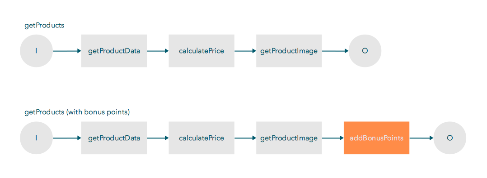

# Pipelines

 ## What Is a Pipeline?

 A pipeline is an extendable list of subsequently
 executed functions called steps. Your app can call a
 pipeline by name through a pipeline request. By default,
 you provide a pipeline step by an extension.

 ### Pipeline Example

 For example, you app displays a catalog of products, and
 users can navigate to a certain product within your app.
 To navigate to the product, you create a `getProduct`
 pipeline. The `getProduct` pipeline includes a product
 description, a price, and a picture that displays on the
 product page of your app. You can create separate
 pipeline steps for different parts of the product, such
 as getting the product description, calculating the
 price, and adding a picture to the product. You create
 all of these steps through a catalog extension. 

 Every pipeline is extendable, meaning you can add more
 steps to it. For example, you can extend the
 `getProduct` pipeline with a bonus point count for the
 product. The new step does not need to be a catalog
 extension. For example, the bonus point count can be in
 a bonus points extension instead of the catalog
 extension. 

 When you send a pipeline request to this pipeline, the
 result is a product page with bonus points attached to
 it.

### Structure

 Pipelines are specified in a `.json` file and are a part
 of an extension. The pipeline consists of pipeline
 metadata, an input/output definition, and a list of
 steps.

 #### Metadata

 The metadata includes the following information:

 * A pipeline id, which is the pipeline name and filename
 * A flag indicating whether the pipeline is callable
 from the outside. If `false`, you can only [call the
 pipeline by another
 pipeline](../../../references/connect/extensions/pipeline/pipeline-step.md)
 in the [same
 environment](#regular-and-trusted-pipelines).

 #### Input/output Definitions

 The input definitions specify pipeline requirements to
 generate the defined output. These specifications must
 be met by the request and by the steps generating the
 output; otherwise, the pipeline request fails. Refer to
 the [Pipeline
 Reference](../../../references/connect/extensions/pipeline/overview.md).

 #### Step List

 A pipeline is a list of steps. These steps must consume
 all provided pipeline input to generate the specified
 output. 

 #### Regular and trusted pipelines

 You can run a pipeline within a trusted environment or
 the regular environment.

 Pipelines and steps running in a trusted environment
 have access to certain steps that regular pipelines can
 not access. You use a pipeline within a trusted
 environment for sensitive data and actions such as
 payments or user login.

 Pipelines can only use steps that are in their
 respective environment. For example, pipelines in a
 trusted environment can only use steps of a trusted
 extension. However, a [pipeline can call another
 pipeline in a different
 environment](../../../references/connect/extensions/pipeline/pipeline-step.md).

>Extensions and pipelines marked as trusted are carefully reviewed by Shopgate. The review process looks for malicious code.

### Naming conventions

 Here is the default naming convention for a pipeline:

 `<organization>.<collection>.<action>.<version>.json`

 Example: `shopgate.catalog.getProducts.v1.json`

 ### Pipeline requests

 You can [run pipeline requests
 directly](../../tools/platform-sdk.md#using-the-proxy-server)
 to your Sandbox App using the SDK.

>When requesting a pipeline, remember there is a 20 second timeout. If the pipeline takes longer than 20 seconds, you will receive an `ETIMEOUT` error.
