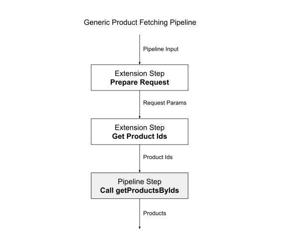
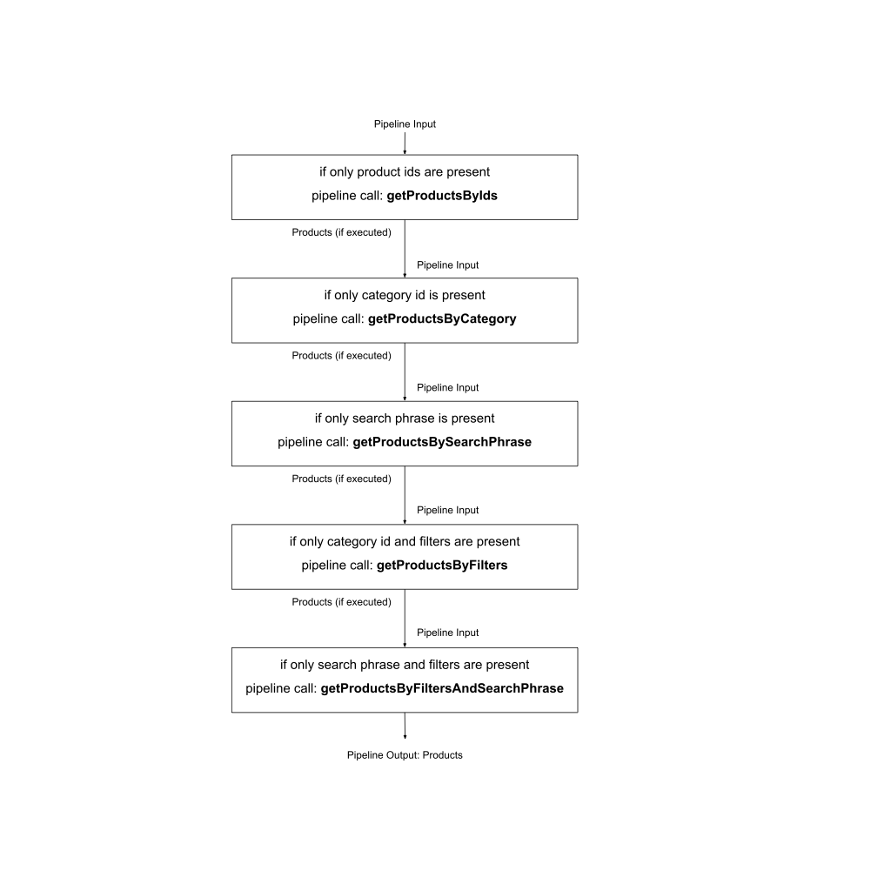

# Fetching Products

 This guide describes how products are fetched on
 Shopgate Connect and how you can extend this
 functionality.

 > **Prerequisites:**
 >
 > You should have a basic understanding of platform
 features such as pipelines, automatic step insertion, and hooks.

 ## How Product Fetching Works

 The app utilizes several calls to fetch
 products. This guide describes how these methods work
 and how you can extend their functionalities.

 ### Fetch Products by Category

 This type of call occurs when a user navigates into a
 category populated with products. For example, in a
 clothing app, when the user navigates into the category
 Women > Dresses, all available dresses in the category
 are fetched.

 ### Fetch Products by Search Phrase

 This call occurs when products are displayed as the
 result of a search phrase entered by a user in the app.
 The resulting products do not have to be in a single
 category. Depending on how you configure your search provider, this call matches the search term to all product text fields. Using the clothing app example from above, when the user enters the search term “red,” all products that include “red” in the product name, description, tags, properties, and so on, are fetched.

 ### Fetch Products by Filter

 This call occurs when a user navigates into a category
 and applies filters on the product list. For example,
 when a user navigates into the category Women > Dresses,
 a list of available filters is displayed to them. When
 the user selects a minimum price of $100 and a maximum
 price of $500 as filter, all products in the category
 that are in this price range are fetched.

 ### Fetch Products by Filter and Search Phrase

 This call occurs when a user fetches the products by
 search term and applies filters to the resulting product
 list. When a user enters the search phrase "red", the
 app displays a list of available filters to the user.
 When the user selects size "L" as a filter, all products
 with that size and the search phrase "red" are
 fetched.

 ### Fetch Products by IDs

 This type of call occurs when deep linking is used for
 navigation to an individual product.

 ## Pagination on the Product Pipelines

 Every product pipeline offers the following parameters
 for pagination: `offset` and `limit`. A request is
 limited to 20 products by default, with a maximum of 100
 products per request. Every pipeline provides the
 `totalProductCount` parameter, which indicates how many
 products are retrievable overall.

 To request the next batch of products, add the
 previous limit to the previous offset, then set it as
 the new offset until the total product count is reached.

 ## Implementation Details

 The following section describes the pipelines involved
 in fetching products. 

 ### shopgate.catalog.getProductsByIds.v1

 The `shopgate.catalog.getProductsByIds.v1` pipeline is fundamental for
 fetching products. It requests a list of ordered product
 ids and returns a list of products in the same order.
 This pipeline is called by all other pipelines
 to get products.

 As such, all the following pipelines for fetching
 products are required to pass a sorted list of product
 IDs to this pipeline.

 

 ### shopgate.catalog.getProductsByCategory.v1

 The `shopgate.catalog.getProductsByCategory.v1` pipeline gets all products
 of a category. It first gets all the ids in a selected
 order (such as price ascending or price descending) and
 passes them to the `shopgate.catalog.getProductsByIds.v1` pipeline.

 This pipeline is triggered when the the user navigates
 into a category and the product count of this category
 is greater than zero. This behavior also applies to the root
 category.

 ### shopgate.catalog.getProductsBySearchPhrase.v1

 The `shopgate.catalog.getProductsBySearchPhrase.v1` pipeline gets a search
 phrase provided by the user and fetches the product ids
 according to the search phrase in the correct order.
 Afterwards, it passes them to the `shopgate.catalog.getProductsByIds.v1`
 pipeline.

 This pipeline is triggered after the user enters a
 search phrase in the app at any point.

 ### shopgate.catalog.getFilters.v1

 This is not a product fetching pipeline. This pipeline
 provides the available filters for a set of products.
 Therefore this pipelines needs either the search term or
 the current category to know the current set of
 products. It returns a list of available filters and
 their rules. For example, it may return a list of
 filters including the filter "price".

 This pipeline is called in parallel to getting products
 from either a category or a search phrase.

 ### shopgate.catalog.getProductsByFilter.v1

 First, this pipeline gets product IDs by a category and
 passed filters. Then it passes them to the
 getProductsByIds pipeline. 

 When navigating into a category filled with products, a
 user can apply filters provided by the getFilters
 pipeline. After the user applies the filters, this
 pipeline is called.

 ### shopgate.catalog.getProductsByFilterAndSearchPhrase.v1
 

 As above, but with search phrase instead of category
 ID. 

 After searching for products via search phrase, a user
 can apply filters provided by the `shopgate.catalog.getFilters.v1` pipeline.
 This pipeline is called after the user applies the
 filters.

 ### shopgate.catalog.getProducts.v1

 This pipeline combines all the other
 product fetching pipelines into a single pipeline.
 Internally, it checks for the input and decides whether
 `shopgate.catalog.getProductsByIds.v1`, `shopgate.catalog.getProductsByCategory.v1`,
 `shopgate.catalog.getProductsBySearchPhrase.v1`, `shopgate.catalog.getProductsByFilter.v1` or
 `shopgate.catalog.getProductsBySearchPhraseAndFilter.v1` needs to be called.

 

 This guide describes how our current themes work. These methods will change in the future as we plan to call the separated pipelines when they need to be called. 

 ## Extending Product Fetching Functionalities

 The most frequent changes to the product fetching are either updating the product data with values such as title or descriptions or adding new properties like bonus points.

 ### Extend Products

 If you want to extend product information with your extension, use the `shopgate.catalog.getProductsByIds.v1` pipeline. There is a hook called “afterFetchProducts” where you can add, update, or delete product properties.

 ### Change Search Provider

 To change the search provider, you need to change the
 following pipelines:

* `shopgate.catalog.getFilters.v1`
* `shopgate.catalog.getProductsBySearchPhrase.v1`
* `shopgate.catalog.getProductsByFilter.v1`
* `shopgate.catalog.getProductsBySearchPhraseAndFilter.v1`

 >Refer to the tutorial [How to Integrate a Search Provider](/tutorials/advanced/search-provider) to see this
 in detail.
