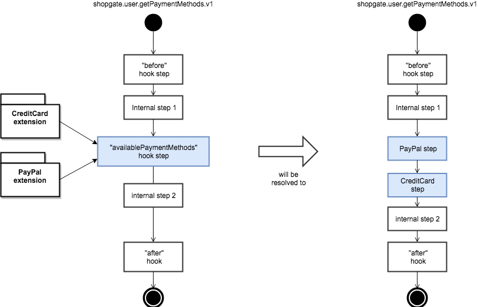
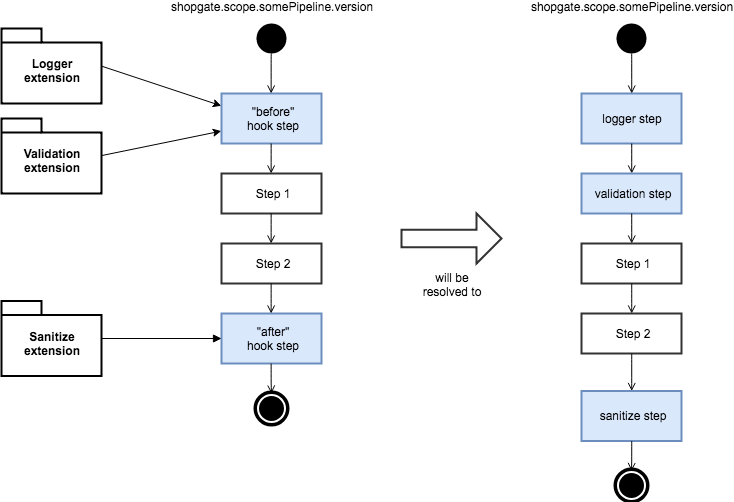
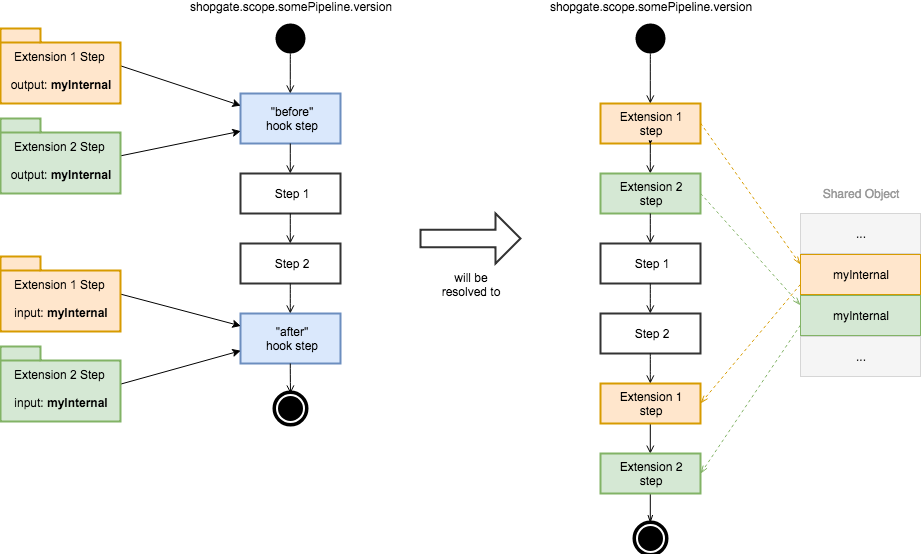

# Automatic Step Insertion


 This guide shows how to use Automatic Step Insertion. To
 use this guide, you need to understand pipelines,
 extensions and steps.


 ## Altering Pipelines


 You may need to alter pipelines to provide additional
 data to the frontend in some cases, such as loyalty
 points of products. Therefore, you need to manipulate
 the data that is returned by the
 "shopgate.catalog.getProducts" pipeline.


 In rare cases, you may need to use the following method
 to extend or alter pipelines:

 Copy the pipeline into your extension and add your step
 to the pipeline. If another extension wants to alter the
 data returned by "shopgate.catalog.getProducts" pipeline
 as well, it would have to do the same.


 This approach is not the preferred method. The problem
 with this approach is only one extension can provide the
 "shopgate.catalog.getProducts" pipeline and the last one
 installed during deployment is added to the pipeline. 


 ## Altering pipelines by Hooks


 A pipeline can contain defined places where steps can
 automatically be inserted. In your extension, you can
 configure your extension to insert certain steps into
 specific places within selected pipelines. This
 insertion happens automatically during deployment or
 development.


 All input and output values of the provided step are
 defined by the hook step in the pipeline. One hook step
 can hold multiple steps, but the order of the steps in
 the hook is not guaranteed and should not be relevant.


 Example:


 The pipeline "shopgate.user.getPaymentMethods.v1" is
 available in your application. This pipeline shows the
 user which payment methods are available in the current
 context. Every payment extension provides a step that
 adds one specific payment method to the output of the
 "shopgate.user.getPaymentMethods.v1" pipeline.


 Without the Automatic Step Insertion feature, a system
 integrator must add all steps from every payment method
 extension to the pipeline.


 With the Automatic Step Insertion feature, the payment
 extension developer just defines—within their extension
 configuration—that the payment method step should be
 placed into the "availablePaymentMethods" pipeline.


 During deployment, the hook step is replaced with the
 steps of the extensions, as shown in the following
 image.

 

## Implicit Hook Steps


 By default, every pipeline has two hook steps: `before`
 and `after`. These hook steps are placed at the
 beginning and end of the pipelines even though they are
 not specifically stated within the pipeline file. You
 can see this in the following image. Be aware that
 specifically stating these hook steps within a pipeline
 results in an error.



Steps inserted into the `before` hook step can use the
 pipeline input as input and manipulate the pipeline’s
 inputs and outputs.


 Steps inserted into the `after` hook step can use the
 pipeline input and output as input and manipulate the
 pipeline’s outputs.


 ## Internal Inputs and Outputs


 If an extension inserts multiple steps into a pipeline,
 these steps can share inputs and outputs internally. No
 step of another extension nor the pipeline can access
 the internal inputs and outputs of these inserted steps.
 This way you can prevent collisions of input or output
 keys when extensions insert steps into the pipeline
 which may have the same name.

 

In the following example, internalValue is accessible
 from all steps of the shopgate/awesomeHooks extension:


 ```json
{
    "version": "1.0.0",
    "id": "@shopgate/awesomeHooks",
    "components": [],
    "steps": [
        {
            "path": "extension/myAwesomeStep.js",
            "description": "This defines a 'before' step for getProducts pipeline",
            "hooks": [
                "shopgate.catalog.getProducts.v1:before"
            ],
            "input": [
                {
                    "key": "categoryId"
                }
            ],
            "output": [
                {
                    "key": "categoryId"
                },
                {
                    "key": "internalValue",
                    "internal": true
                }
            ]
        },
        {
            "path": "extension/myAwesomeStep2.js",
            "description": "This defines an 'after' step for getProducts pipeline",
            "hooks": [
                "shopgate.catalog.getProducts.v1:after"
            ],
            "input": [
                {
                    "key": "categoryId"
                },
                {
                    "key": "internalValue",
                    "internal": true
                }
            ],
            "output": [
                {
                    "key": "categoryId"
                }
            ]
        }
    ]
}
 ```
