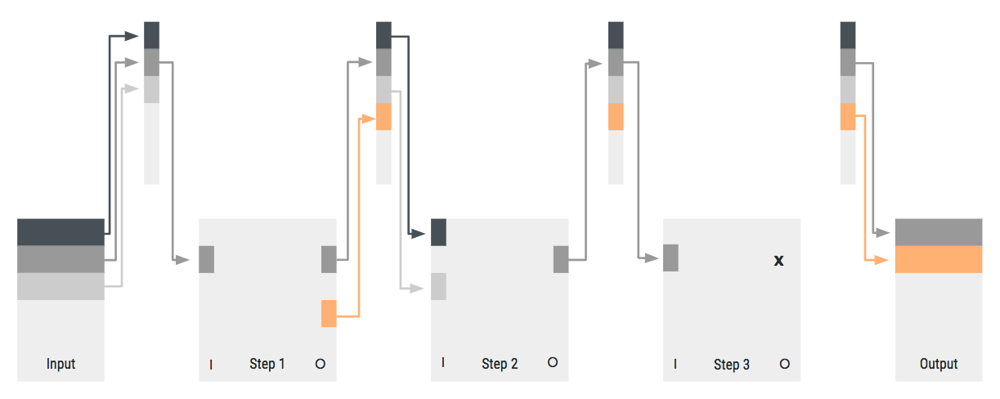

# Steps


 ## What Is a Step?

 Steps are specific actions within a pipeline. Here are
 some common actions you can complete with steps:

 * Log in a user into the app
 * Get data from an external data source
 * Send HTTP requests to an external server
 * Alter the structure of a javascript object


 See [step reference](../../../references/connect/extensions/pipeline/pipeline-step.md) for information on the available step types.


 ## Extension Step

 In code, a step is a Node.js module that returns a
 single function with a specified interface. 


 Each step function has two important parameters:
 `context` and `input`. 


 ### Context

 The context is an object that lets you access everything
 the step needs for execution except for the steps’
 input. The context object includes a logger, a storage
 for several different scopes, settings of the
 application, general metadata, and the extension config.


 #### Logger

 Each step function has a context-aware logger available
 as `context.log`. The logger is based on the [Bunyan
 logger](https://github.com/trentm/node-bunyan). You can
 use it to log the following common log levels:

 ```

 context.log.trace(additionalDataObject, msg)
 context.log.debug(additionalDataObject, msg)
 context.log.info(additionalDataObject, msg)
 context.log.warn(additionalDataObject, msg)
 context.log.error(additionalDataObject, msg)
 context.log.fatal(additionalDataObject, msg)

 ```

> In the production environment, the log level is set to info, meaning messages equal to or higher than info are logged. In the sandbox environment, the log level is set to debug.

#### Storage

Sometimes an extension or the step of an extension needs to store data or retrieve data from storage.

You can use data storage when data must be persistent between multiple pipeline requests. For example, you can store data when a user logs in to a service and receives an access token. You put the token data into storage. Later, pipeline requests with steps that need to access the service can reuse the stored token.

Storage is scoped by extension. When there are steps of two different extensions within a pipeline, those steps can only access the storage of their respective extension. 

The context object provides three different storage types: the extension-, device-, and user storage.


| Storage name | Usage | Scoped by | Availability |
| ---|---|---|---|
| `extension` | when you need to store data in an application-wide scope | extension | always |
| `device` | when you need to store data associated with a device | extension and device | always |
| `user` | when you need to store data across devices associated with a user | extension and user | [when user is logged in](../../../references/connect/extensions/pipeline/auth-step.md) |

See [storage reference](../../../references/connect/extensions/steps/storage.md).
    
Each storage type provides a simple key/value storage and a map storage. You can store any value (strings, numbers, arrays, objects) for a key. You can access complete maps or access items directly from map storage. 

>Key/value and map storage are not related to each other: the `get('foo')` method of the key/value store won’t return the same result as the `get('foo')` method of the map store.


#### Meta

 The Meta object provides basic request information, such
 as the app id of the device where the request
 originated. The Meta object includes the following
 properties:

 * **appId**: your application’s id
 * **deviceId**: the current device id
 * **userId**: the current user’s id (if logged in,
 otherwise null)
 * **headers**: HTTP request headers if pipeline request
 originated from browser; undefined if not from browser
 * **cookies**: HTTP request cookies if pipeline request
 originated from browser; undefined if not from browser


 #### Config

 The config object of the context contains extension-wide
 config values for the step. These configurations are
 written by the SDK during the deployment of the
 application. 

 When developing on a sandbox app with the SDK, these
 configs are stored in the `config.json` files that are
 created when altering the `extension-config.json` file.


 See [SDK automations](../../../guides/tools/platform-sdk.md#automations)
 and/or [extension config](../../../references/connect/extensions/configuration.md).


 #### Input

 The input parameter is an object whose content is
 defined by the pipeline definition.


 See [pipeline reference](../../../references/connect/extensions/pipeline/overview.md)
 and/or the [shared object](#shared-object).


 #### Returns

 The exported function of a step can return in three
 ways:

 call a callback such as:

 * `cb(err, output)`
 * return a promise, which resolves if everything ran
 successfully or rejects with an error if something went
 wrong
 * return the output object directly or throw an error in
 case you use the async/await way of implementing the
 function
 
 The return object has to meet the output specified
 within the pipeline file.


### Shared Object

Pipelines and their steps share an object to get input
and put output into the object.





The image demonstrates how the shared object works
 within a pipeline.


 The pipeline requires three inputs and returns two
 outputs. The initial input of the pipeline gets put into
 the shared object.


 While processing the pipeline, steps can read inputs
 from and write outputs to the shared object. This
 enables a step to use the output of any former step (not
 just the direct neighbors) as an input.


 #### Storing and Retrieving Data From the Shared Storage Object
 

 The shared object is a storage where pipelines and steps
 can put data into or retrieve data. Inputs have names
 `(“key”: “input1”)` for the usage within the step, but
 are stored as a separate id within the shared object.


 For example, a pipeline has the input `productId`. The
 value of `productId` will be stored as id `1` in a
 shared object. A step requiring the data that was stored
 can now get the data by getting the value of id `1` and
 then map this value into a new input with the name
 `pId`. You can name inputs or outputs anything because
 they do not affect the naming in the shared object.


 #### Example

**Here is the input**
```json
{
    ...
    "input": [
        {
            "key": "productId",
            "id": "1"
        }
    ]
    ...
}
```

The shared object contains id `1` which we expect to see in the request parameter `productId` when the pipeline is called.


**Step input**
```json
{
    ...
    "input": [
        {
            "key": "pId",
            "id": "1"
        }
    ]
    ...
}
```

The step takes id `1` from the shared input and maps it to the input key `pId`.


**Step function**
```jsx
module.exports = async (context, input) => {
    console.log(input.pId)
    return { p: input.pId }
}
```

The step function takes the input key `pId` and sets its value to the output key `p`.


**Step output**
```json
{
    ...
    "output": [
        {"key": "p", "id": "2" }
    ]
    ...
}
```
The value of output key `p` maps to ID `2` in the shared object. The shared object now contains two IDs (`1` and `2`) with the same value.

**Pipeline output**
```json
{
    ...
    "output": [
        {"key": "productId", "id": "2" }
    ]
    ...
}
```


The pipeline returns what is stored in ID `2` in the
 shared object as the property `productId` in a result
 object.


 ### Steps

 Every step has an input, an output, and a type.


 The type can be one of the following: *extension*,
 *auth*, *conditional*, *errorCatchExtension*,
 *pipeline*, or *staticValue*.


 See
 [Steps](../../../references/connect/extensions/pipeline/common-step-structure.md)
 to learn more about step types.


 Both input and output are arrays of objects. These
 objects define a specific input or output element. This
 element describes the mapping between the step and the
 shared object. The element itself consists of two
 properties: `key` and `id`.


 Example: `{"key": "productId", "id": "1"}`


 #### Inputs

 The key value is accessible by the step. For example, an
 extension step can access the value of `key`:
 `productId` with `input.productId` inside of the step
 function.


 The `id` describes where the step gets the input for its
 `key`: `productId`. In the Shared Object product id
 example, this is the value of `id`: `1` within the
 shared object.


 #### Outputs

 The key is what is returned by the step. For example, an
 extension step can return the value of `key`:
 `productId` with return `{productId: "PID1"}` inside of
 the step function.


 The id describes where the step puts the value of `key`:
 `productId`. In the Shared Object product id example
 this is the value of `id`: `1` within the shared object.

**Pipeline:**
 ```json
{
    "type": "extension",
    "input": [
        {"key": "input1", "id": "1"},
        {"key": "input2", "id": "2"}
    ],
    "output": [
        {"key": "output1", "id": "10"},
        {"key": "output2", "id": "20"}
    ],
    ... (other step type dependent properties)
}
 ```

 for other step type dependent properties: see [Steps](../../../references/connect/extensions/pipeline/common-step-structure.md).
