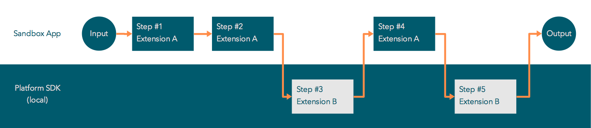
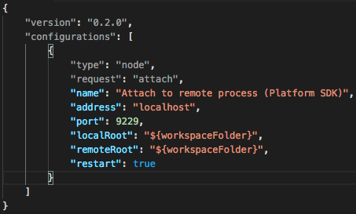
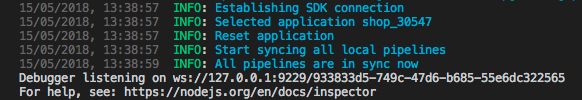
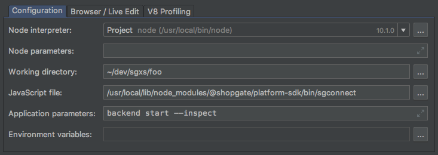

# Platform SDK

The Platform SDK is a command line tool for developing frontend and backend extensions and themes. The Platform SDK is available for Windows, Mac, and Linux. You can find the source code on [GitHub](https://github.com/shopgate/platform-sdk) and download releases from [npm](https://www.npmjs.com/package/@shopgate/platform-sdk).

> **Prerequisites:**
>
> Before using the Shopgate Platform SDK, you should have a basic understanding of the following topics: Extensions, [Pipelines](/guides/technical/connect/pipelines), and [Steps](/guides/technical/connect/steps).

## How To Install the Platform SDK

The Shopgate Platform SDK is based on Node.js and **requires Node.js version 12** installed on your development machine.

To install the Platform SDK, open a terminal (as a user with permission to install software) and type:

```shell
$ npm install -g @shopgate/platform-sdk
```

For any installation issues, refer to the [npm troubleshooting page](https://docs.npmjs.com/getting-started/fixing-npm-permissions).

After installation, the `sgconnect` command appears within the terminal and allows you to perform all actions required to develop on the Shopgate Connect Platform.

To check the version of the installed SDK, type:

```shell
$ sgconnect --version
```

### Releases

Shopgate releases the Platform SDK in [Semantic Versioning style](https://semver.org/). The latest version of the Platform SDK is mandatory. When you start the Platform SDK, it checks for the latest version. If a newer version is available, an update message displays. 

You can find releases of the Platform SDK on the [GitHub releases page](https://github.com/shopgate/platform-sdk/releases).

## Use the Platform SDK

The Platform SDK enables you to develop backend extensions, frontend extensions, and themes. You can test all of these application components within a sandbox app. The following sections explain how to develop these components with the Platform SDK.

### Log In with Your Account

Before you can use the Platform SDK for developing extensions or themes, you need to authenticate against the Shopgate platform. A [Shopgate Developer Account](https://developer.shopgate.com/admin/signup) is required.


Log in to the Shopgate Connect Platform:

1. Type `sgconnect login`.
2. Enter your Shopgate Developer account username and password.

After initially logging in, a session file is created and stored in your user directory for later Platform SDK requests so you do not have to log in again.

Refer to [sgconnect login](../../references/connect/platform-sdk/login.md) in the reference documentation for more information.

## Initialize a New Project

A new project is bound to a Sandbox App. You must be a member of the organization which owns the Sandbox App to have access rights to the Sandbox App. Access rights are required to initialize a new project.

> A project is bound to a Sandbox App, but a Sandbox App is not bound to a project. You can use one Sandbox App for multiple projects. For example, if you create a project for the development of two extensions for application A, you can use the same Sandbox App for the development of extensions or themes for application B, as long as you create a new project folder for application B. The only restriction is that you cannot work on the same Sandbox App with application A and B at the same time.

To initialize a new project:

1. Create a new folder for a project.
2. Within the project folder, type: `sgconnect init`.
3. When the command prompts you, enter the Sandbox App associated with the project.

#### File Structure

Executing `sgconnect init` creates a project file/folder structure with the following:

| File/Folder                  | Description |
| ---------------------------- | ----------- |
| `.sgcloud/`                  | Folder that contains project-related files |
| `attachedExtensions.json`    | File that stores information of all currently attached extensions, see [attach extensions](/references/connect/platform-sdk/extension) |
| `storage.json`               | Storage file for pipelines and extension steps |
| `frontend.json`              | Support file for the frontend process |
| `app.json`                   | Storage file for the Sandbox App ID associated with the project |
| `extensions/`                | Folder for extensions |
| `pipelines/trustedPipelines` | Read-only directory that contains copies of pipelines that are currently available for the Sandbox App. Changes to files in these directories do not affect the execution of pipelines. |
| `themes/`                    | Folder that contains themes such as Shopgate's GMD or iOS theme |

> Do not execute this command in your user directory since there is already a `.sgcloud/` folder that stores login data in your user directory.

#### Re-initializing a Project

If you call the `sgconnect init` command inside of an initialized project (on any level) the command causes a project reset. But don’t worry: it will ask if you really want to do this. If you confirm the reinit, the command deletes all project-related files, like extension configs and everything in `.sgcloud/`, and sets the project up just like a fresh project.

The command asks you to which Sandbox App you want to connect this project. This request enables you to switch the Sandbox App without setting up a new project.

Refer to [sgconnect init](../../references/connect/platform-sdk/overview.md) in the reference documentation for more information.

### Create a New Extension

After initializing the project, you can create a new extension. 

1. Type `sgconnect extension create`.
2. Enter the extension name and type.

For backend extensions, you also enter whether the extension [runs in a trusted environment](../technical/connect/pipelines.md#regular-and-trusted-pipelines).

Here are the steps the Platform SDK executes when you create a new extension: 
1. Downloads the Shopgate extension boilerplate from Github into the project's `extensions/` directory.
2. Renames boilerplate to the name you provided (`<organization name>-<extension name>` like: `@shopgate-user`).
3. Removes unused dirs and files (frontend-related items if only backend was selected as type and vice versa).
    1. Removed frontend items:
        * directory: `frontend/`
    2. Removed backend items:
        * directory: `extension/`
        * directory: `pipelines/`
4. Removes placeholders and updates files according to your changes. For example, the Platform SDK updates the organization name and the extension name. All occurences of `@awesomeOrganization/awesomeExtensions` will be named `<organization name>/<extension name>`.
5. Installs dependencies necessary for frontend development for all frontend extensions.

Refer to [sgconnect extension create](../../references/connect/platform-sdk/extension.md) in the reference documentation for more information.

### Attach / Detach an Extension
#### Attaching

Attaching an extension marks the extension as `active` or `in use` for the Platform SDK. The backend and frontend processes require these designations.

An `active` or `in use` mark for backend extensions means steps of attached extensions are being redirected to your local SDK. For frontend extensions this mark means components of attached extensions are getting inserted into the installed theme. 

To attach all extensions in the extensions folder, type:
```
$ sgconnect extension attach
```
To attach specific extensions, type:
```
$ sgconnect extension attach extensionsId1 extensionsId2 ...
```
Refer to [sgconnect extension attach](../../references/connect/platform-sdk/extension.md) in the reference documentation for more information.

#### Detaching
Detaching causes the extension to be “inactive” or “disabled”. Like the attach command, the detach command can be used to detach all extensions or only specific ones.

To detach all extensions in the extension folder, type:
```shell
$ sgconnect extension detach 
```
To detach specific extensions, type:
```shell
$ sgconnect extension detach extensionsId1 extensionsId2 ...
```

Refer to [sgconnect extension detach](../../references/connect/platform-sdk/extension.md) in the reference documentation for more information.

#### Manage
A convenience wrapper around attach & detach is available via the `extension manage` command, which provides a list of available extensions and their current attachment status for selection/deselection.

> When detaching a potential broken extension, you can restore the Sandbox App to its previous state. Restoring the Sandbox enables you to test if there is an error within the former attached extension. For extensions that were only attached and not installed on your Sandbox App, the extension's pipelines, steps, and any frontend components will not be available after detaching.

### Backend Extension Development
Start the backend process to develop your backend extensions and test them on your Sandbox App. Starting the backend process connects your current project with your Sandbox App within the Shopgate Connect Platform.

> **Caution:**
>
> You must attach any extension you want to test before you start the backend process. If you attach extensions while the process is running, those extensions will not connect with your Sandbox App. You must restart the backend process to connect them.

To start the backend process, type:
```shell
$ sgconnect backend start
```

When you enter this command, the backend process completes the following actions:

1. Resets the Sandbox App on the Shopgate Connect Platform. Resetting provides a clean state of the application. Former attached extensions are detached and uploaded pipelines which were in development are removed. Overwritten pipelines are restored. Note that these actions only occur in your Sandbox App. Your local project stays untouched.
2. Uploads the pipelines of all attached extensions.
3. Connects all attached extensions to your Sandbox App. If a step of these extensions is called within a pipeline, the step executes on your local machine.
4. Copies currently used pipelines of your Sandbox App into the general pipelines/trustedPipelines folders. You can view this folder to see the current state of your Sandbox App. 
5. Creates a proxy server on port 8090 on your local machine. You can use the proxy server to send direct pipeline calls to it. 

Refer to [sgconnect backend start](../../references/connect/platform-sdk/backend.md) in the reference documentation for more information.

### Developing Pipelines

You can develop pipelines in two ways: 


* Create a new pipeline within the pipelines folder of your attached extension, OR
* Copy an existing pipeline from your general/trusted pipelines folders into the pipelines folder of your attached extension. Copying an existing pipeline overwrites the pipeline that is currently used by the Sandbox App with the one you copied.

Every time you alter a pipeline in `extensions/<attachedExtension>/pipelines`, the SDK validates and uploads it to your Sandbox App. If the validation and upload are successful, the pipeline is ready for use. If the validation and upload are not successful, the SDK displays an error message such as the following message:

```shell
6/25/2018, 4:56:04 PM ERROR: Pipeline invalid: Missing required property: steps (field=body.pipeline)
```

After uploading, the pipeline downloads again into your general/trusted pipelines directories to indicate it is in use by the Sandbox App.

### Developing Steps

Steps of attached extensions are executed on your local machine. The following graphic displays the execution of a pipeline which uses local steps. Extension A is unattached (deployed) while Extension B is attached via the SDK.



When a step executes locally, such as by calling a pipeline that uses the step, you can print logs directly to your console. Therefore, you must use the logger provided by the step context. The logger is aware of the step that logs the data. For example, a debug log like the following:

```javascript
context.log.debug(responseBody, `Got ${type} status`)
```

would look like this:
```bash
15/03/2018, 11:43:36 DEBUG: [@shopgate/testExtension/testStep.js]: { status: 'OK' } Got request status
```

See [logger reference](../../references/connect/extensions/steps/logger.md).

### Debugging Step Code

You can also use a debugger to debug steps by running the SDK with the inspect flag (`--inspect`). The debugger is currently supported for VS Code and Php- / Webstorm.

#### VS Code

To use the debugger in VS Code, alter the `.vscode/launch.json` file in your project directory. Add the following launch configuration to the file:

```json
{
  "type": "node",
  "request": "attach",
  "name": "Attach to remote process (Platform SDK)",
  "address": "localhost",
  "port": 9229,
  "localRoot": "${workspaceFolder}",
  "remoteRoot": "${workspaceFolder}",
  "restart": true
}
```

The screenshot shows a `launch.json` file with the launch configuration added (only one launch configuration):



After you alter the file, you can start the backend process with the inspection flag by typing:
```shell
$ sgconnect backend start --inspect
```

The following log appears during start:
```shell
Debugger listening on
ws://127.0.0.1:9229/4157ea69-993d-4f9f-9722-2d4d10fe4db6

For help see https://nodejs.org/en/docs/inspector
```



While the process is running, you can start the debugger of VS Code by pressing the debugger play button with the configuration *“Attach to remote process (Platform SDK)”* selected.

The console then shows the following message:
```shell
Debugger attached.
```

Set breakpoints in step code are now inspectable and pause the execution.

#### PHP- / Webstorm 
To use the debugger in PHPStorm, add a new run configuration by selecting the plus sign.

1. Select the Node.js preset for the configuration.
2. Configure the settings of the Node.js preset with the following:
    * Working directory: Leave the default
    * Javascript file: Enter the absolute path to the sgconnect executable
    * Parameters: enter `backend start --inspect`
3. Save the run configuration.
4. Select the bug button to start the debug mode.



Besides the default console logs of the backend process, your terminal also displays a message indicating the debugger is running:
```
Debugger listening on ws://127.0.0.1:9229/4157ea69-993d-4f9f-9722-2d4d10fe4db6
For help see https://nodejs.org/en/docs/inspector
```
Set breakpoints in step code are now inspectable and pause the execution.

### Using the Proxy Server
The purpose of the proxy server is to simplify pipeline calls to the Sandbox App. Follow these guidelines for calling a pipeline:
* Use `http://localhost:8090/pipelines/<pipelineName>` for regular pipelines and `http://localhost:8090/trustedPipelines/<pipelineName>` for trusted pipelines.
* Send an HTTP POST request with the content-type: application/json.
* Send the input of the pipeline as a JSON object. If the pipeline does not require any input, send an empty JSON object.
* If a local step takes longer than eight seconds, it will time out. If the pipeline request itself takes longer than 20 seconds, it will also time out.

### Theme / Frontend Extension Development
To develop and test frontend extensions, the Platform SDK enables you to run the frontend locally. The served frontend watches for changes in your code and updates the view seamlessly.

#### Set Up the Frontend (optional)
Typically, the frontend start command implicitly starts the set up. However, you can manually execute the set up. For example, you can re-execute the step if your IP changes.  

To set up the frontend:

1. Type `sgconnect frontend setup`.
2. Check that your local IP address displays correctly or type in the correct IP.
3. Enter the port where the local frontend gets served (webpack-dev-server).
4. Enter the port for the Shopgate Connect API proxy. The locally running frontend requests data on this port. The proxy translates the requests to this port.
5. Review the default settings for the following items:
    1. Hot Module Replacement port: Hot Module Replacement (HMR) exchanges, adds, or removes modules while an application is running, without a full reload. Refer to [Webpack hot module replacement](https://webpack.js.org/concepts/hot-module-replacement/) for more information.
    2. Remote dev server port: Port of bridge for communicating remotely via Redux DevTools extension, Remote Redux DevTools, or RemoteDev.
    3. Source map type: Describes the kind of source maps. Refer to [Webpack devTool](https://webpack.js.org/configuration/devtool/) for more information.

#### Start the Local Frontend Server
To start the local for frontend server, type:
```shell
$ sgconnect frontend start
```
This command starts everything according to your set up. The start command uses an installed theme by default. If you have multiple themes installed, the command prompts you to select one. 

During start, the system does the following:
* Creates the app.json file from the `extension-config.json`.
* Starts a proxy server to call the Shopgate Connect service.
* Starts the webpack development server, which compiles the frontend and also recompiles on file changes.

When requesting `http://<local ip address>:<port you entered during setup>` (e.g. `http://localhost:8080`) the selected theme displays in your browser.

### Automations
There are several automations that you have to be aware of when using the SDK.

When the `extension-config.json` file changes, certain files that depend on the `extension-config.json` file are recreated.

| file | when | what |
| ---- | ---- | ---- |
| `extension/config.json` (of current extension) | backend-, frontend process: on start; when current `extension-config.json` file is altered | frontend / backend configs get resolved |
| `config/components.json` (of all themes) | frontend process: on start; when any `extension-config.json` file is altered | components are gathered and updated in the `components.json` files |

Pipelines in `extensions/<extension>/pipelines` are also watched. When a pipeline of an attached extension is altered, the pipeline uploads to the Sandbox App. If the pipeline uploads successfully, it gets downloaded to the project's (trusted) pipelines directory, which indicates the pipeline is in use by the Sandbox App.

## Uploading an extension

To use an extension in your application, you should first upload it to the Shopgate Developer Center.

> **Prerequisites:**
>
> Before uploading a new extension, you must create it in the Shopgate Developer Center. Use the SDK to create new extension versions.

To upload an extension, type the following:
```
$ sgconnect extension upload [extDir]
```
where ```extDir``` is the name of the directory where your extension resides.

If ```extDir``` is not specified, a list of all local extensions is shown. Select one of them.

The command triggers the following actions:
1. Validation of the ```extension-config.json```.
2. Packing the extension directory into the TAR-archive.
3. Uploading the archive to the Shopgate Developer Center.
4. Waiting for the uploaded extension preprocessing to complete.

If you are uploading a new version of the extension and it was not created in the Shopgate Developer Center, a prompt asks if the version should be created automatically. You can suppress the question and force the creation of the new version by passing the ```--force``` (or ```-f```) command line argument as follows:
```shell
$ sgconnect extension upload awesomeExtension --force
```

If a review is requested for the version you are uploading, a prompt asks if the request should be canceled. Specifying ```--force``` (or ```-f```) suppresses this question as well.

> **Note:** 
>
> You cannot upload an extension version if it was released, withdrawn, or is currently under a review. You must update the version number in order to upload it.

After the extension is successfully uploaded, you can login to the Merchant Admin to deploy it to the sandbox applications of your organization. When you finish the extension, request a review of it.

## Uploading a theme

To use a theme in your application, you should first upload it to the Shopgate Developer Center.

> **Prerequisites:**
>
> Before uploading a new theme, you must create it in the Shopgate Developer Center. Use the SDK to create new theme versions.

To upload a theme, type the following:
```
$ sgconnect theme upload [themeDir]
```
where ```themeDir``` is the name of the directory where your theme resides.

If ```themeDir``` is not specified, a list of all local themes is shown. Select one of them.

The command triggers the following actions:
1. Validation of the ```extension-config.json```.
2. Packing the theme directory into the TAR-archive.
3. Uploading the archive to the Shopgate Developer Center.
4. Waiting for the uploaded theme preprocessing to complete.

If you are uploading a new version of the theme and it was not created in the Shopgate Developer Center yet, a prompt asks if the version should be created automatically. You can suppress the question and force the creation of the new version by passing the ```--force``` (or ```-f```) command line argument:

```
$ sgconnect theme upload awesomeTheme --force
```

If a review is requested for the version you are uploading, a prompt asks if the request should be canceled. Specifying ```--force``` (or ```-f```) suppresses this question as well.

> **Note:**
>
> You cannot upload a theme version if it was released, withdrawn, or is currently under a review. You must update the version number in order to upload it.

After the theme is successfully uploaded, you can log in to the Merchant Admin to deploy it to the sandbox applications of your organization. When you finish the theme, request a review of it.
