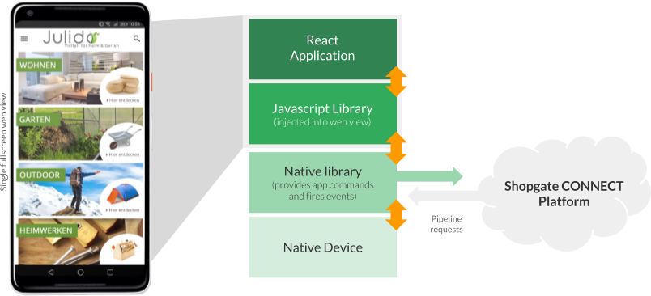
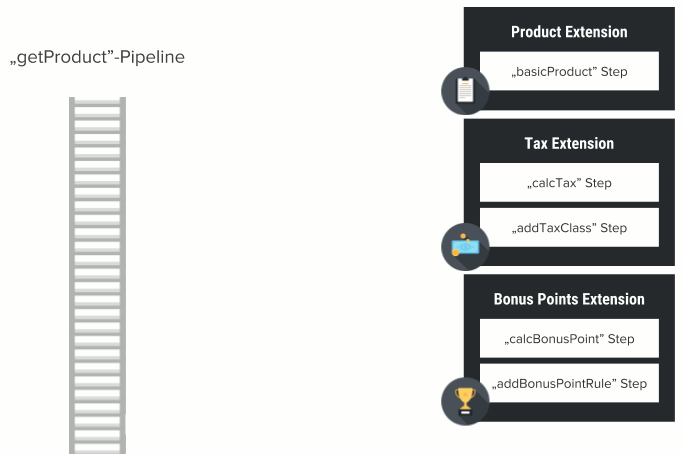
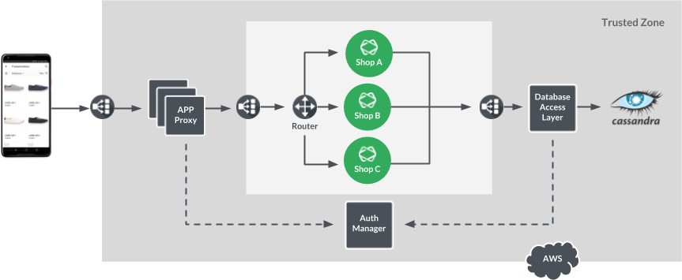

# App Architecture

 An application built on the Shopgate CONNECT platform is
 a progressive web app (PWA) with a UI based on React
 that runs inside a native wrapper app. Native wrappers
 are available for iOS and Android so you can easily
 distribute your app on the Apple App Store or Google
 Play.

 Shopgate provides ready-to-run default themes (the React
 app) for e-commerce applications. You can modify themes
 with Shopgate portals, or you can create custom themes
 that can be modified or completely replaced by custom
 themes. 

 The app frontend is based on JavaScript, and the
 frontend communicates to the native wrapper app through
 a system of commands and events. 

 The wrapper app displays a single full-screen web view,
 which is a browser window without any controls. The
 wrapper app loads the frontend of your app into the
 single full-screen web view.

To communicate with the native parts of the app, a
 JavaScript library is injected into the web view. This
 library is connected to a native library contained in
 the app’s native code. By calling app commands and
 listening to events, the frontend can access native
 functionality, such as camera, brightness, and
 vibration, and can talk to native SDKs and frameworks.

 Both the app frontend and native wrapper also connect to
 the backend infrastructure. The backend is based on
 micro-service architecture.

## Backend Communication

 You invoke actions and receive data from the backend
 through a pipeline request. Shopgate CONNECT includes
 many predefined pipelines, but you can alter the process
 logic of pipelines by developing custom extensions.
 Pipeline requests are named actions, such as getProduct,
 and they are similar to remote procedure calls with
 defined inputs and outputs. Pipeline requests are
 configurable and extensible.

 Pipelines execute with a number of steps provided in
 JavaScript files. You can configure the order and
 input/output of data flow for each pipeline. Pipelines
 can take the output of a previous step and use it as
 input for the next step, or they can operate
 independently of the previous step.

For example, the image shows the getProduct pipeline.
 The getProduct pipeline contains steps (in black boxes)
 provided by Shopgate CONNECT. These steps return product
 information back to the app frontend. To add a bonus
 point provider, you can create a new step (the red box),
 which adds the bonus points data to the pipeline
 results. Add a custom React component on the frontend to
 display the new bonus points data in the app.

 All backend processing is based on pipelines, which
 gives you the option to extend or replace all
 functionality with custom extensions.

## Extending Your App

You can customize the frontend UI and the backend of
 your app when you use the Shopgate CONNECT platform. You
 create code and configuration data bundled together as
 extensions that are installed by system integrators so
 that applications can enable the custom functionality. 

Extensions for the frontend include widgets and portals.
 You can also use the theme extension type, which is a
 complete frontend application that maps to a certain
 device type. Extensions for the backend are extension
 steps and pipeline configuration files. You can use
 multiple extensions to build a pipeline.

For example, the getProduct pipeline contains a step to
 provide the main product information. You can also add a
 tax extension to calculate tax information, and then add
 a bonus point extension to add the number of bonus
 points.

## Infrastructure Overview

 The Shopgate CONNECT backend consists of a microservice
 architecture built with stateless container technology
 and hosted by Amazon Web Services (AWS). Shopgate
 CONNECT is optimized for high availability, scalability,
 and security. The following diagram shows the main
 components of the request flow.

Incoming requests from the app are load-balanced and
 served by an application proxy which routes them to one
 of the available containers dedicated for this
 particular app. Because you might have custom code
 running inside these app containers, they are located
 outside of the trusted zone (which only consists of
 CONNECT core components) and separated from each other.

 Because all containers are stateless for easy
 scalability, the state of an app is maintained in the
 Cassandra database. The high-performance Cassandra
 database technology enables seamless scalability even
 across regions. The database is highly protected by a
 token-based authorization mechanism. The app proxy
 equips every request with an access token based on the
 current app, user, and session. The access token is
 passed to the database access layer, which then checks
 every single database interaction.
