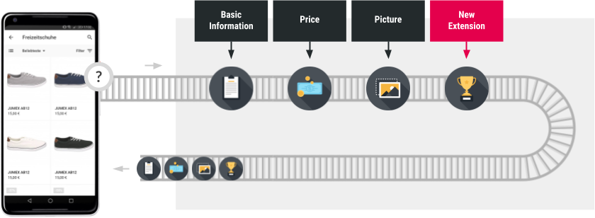

# Backend Communication

 You invoke actions and receive data from the backend
 through a pipeline request. Shopgate CONNECT includes
 many predefined pipelines, but you can alter the process
 logic of pipelines by developing custom extensions.
 Pipeline requests are named actions, such as getProduct,
 and they are similar to remote procedure calls with
 defined inputs and outputs. Pipeline requests are
 configurable and extensible.

 Pipelines execute with a number of steps provided in
 JavaScript files. You can configure the order and
 input/output of data flow for each pipeline. Pipelines
 can take the output of a previous step and use it as
 input for the next step, or they can operate
 independently of the previous step.

For example, the image shows the getProduct pipeline.
 The getProduct pipeline contains steps (in black boxes)
 provided by Shopgate CONNECT. These steps return product
 information back to the app frontend. To add a bonus
 point provider, you can create a new step (the red box),
 which adds the bonus points data to the pipeline
 results. Add a custom React component on the frontend to
 display the new bonus points data in the app.

 All backend processing is based on pipelines, which
 gives you the option to extend or replace all
 functionality with custom extensions.

>**Next:**
>
>[Extending Your App](extending-your-app.md)
