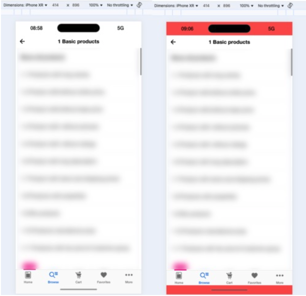

# Set Up Local Frontend


 ## Add a Theme to Your Project


 To test your frontend locally, you need to have a
 Shopgate theme in your project. You can either create a
 theme or check out one of our ready-to-go themes from
 GitHub.


 ## Using the Default Android Theme


 ```shell
 $ cd themes
 $ git clone https://github.com/shopgate/theme-gmd.git
 $ cd theme-gmd
 $ npm i
 $ cd ../..
 ```


 ## Set Up the Frontend Environment


 Type `sgconnect frontend setup` to set up the local
 frontend environment. For most cases, you can accept the
 default values for all requested settings. For more
 information, refer to the [Platform SDK
 guide](../../guides/tools/platform-sdk.md).


 You only need to run the setup step once for every
 project folder. Later you can omit it.


 ## Start the Frontend Environment


 1. Type `sgconnect frontend start` to start the frontend environment.
 2. Wait until the integrated Webpack process compiles your theme sources and starts the local development server. 
 3. After the compile process finishes, you can access  the locally running application by opening the development server URL in your browser:  `http://{YOUR_LOCAL_IP_ADDRESS}:{PORT}` 
 
 You should see your application frontend.


 *Note: The port is set to 8080 by default. If you
 changed the port during setup, you need to use the new
 port to access the development server URL.*

 ### Simulated iOS Safe Area Inset

Helpful development feature: simulated iOS safe area insets. It’s designed to make it easier to adjust custom extensions to accommodate iOS-specific layout constraints, especially for devices with notches or home indicators.

The insets are activated by default when an iOS user agent is selected in the devtools. They can be toggled via keyboard shortcuts (cmd+i on Mac, command+i on Windows / Linux). One can hide them by long pressing on one of the insets.
One can activate additional highlighting by clicking one of the insets.

**How It Works**
* Auto-Activated: Insets are shown automatically when an iOS user agent is selected in your browser’s developer tools.
* Toggle Visibility: Quickly toggle the insets on/off using Ctrl + i on macOS, Windows and Linux.
* Hide Insets: Long press on any inset to hide them.
* Highlight Mode: Click on any inset to activate a visual highlight for better inspection.
This tool gives developers immediate visual feedback on how their UI will behave on real iOS devices.

Example (regular insets + highlighted insets):
