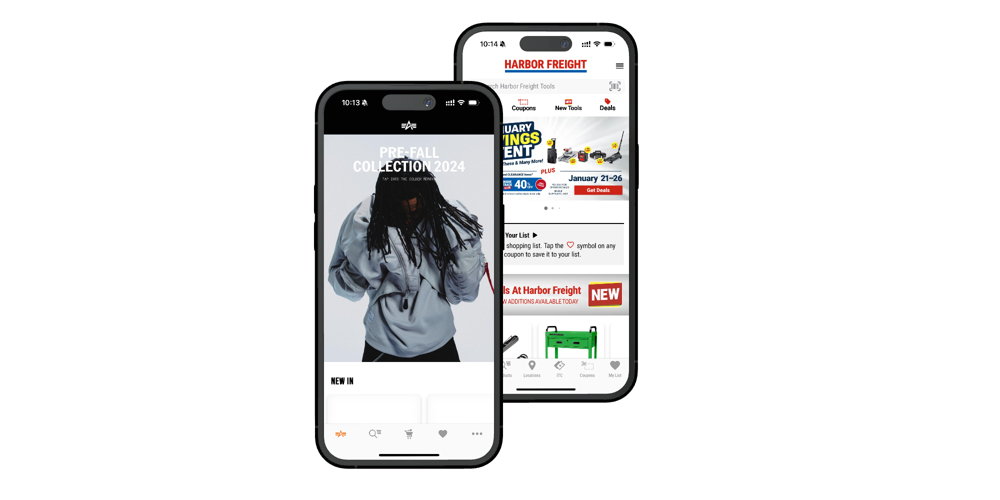

# Introduction

Welcome to Shopgate, the most flexible development platform for mobile shopping apps!

## What is Shopgate?

The Shopgate platform is a cloud-based environment you use to develop and deploy mobile shopping applications. You can use this guide to begin developing for the Shopgate platform.

* [App Architecture](connect-architecture/app-architecture.md)
* [Development Process](shopgate-connect/development-process.md)
* [Platform SDK](../guides/tools/platform-sdk.md)
* [Set Up environment](getting-started/set-up-environment.md)
* [Set Up Local Frontend](getting-started/set-up-local-frontend.md)
* [Test with native apps](getting-started/test-with-cloud-flight.md)
* [Ecommerce Integration](../guides/commerce/cart-integration/connect-your-shop/ecommerce-integration.md)

