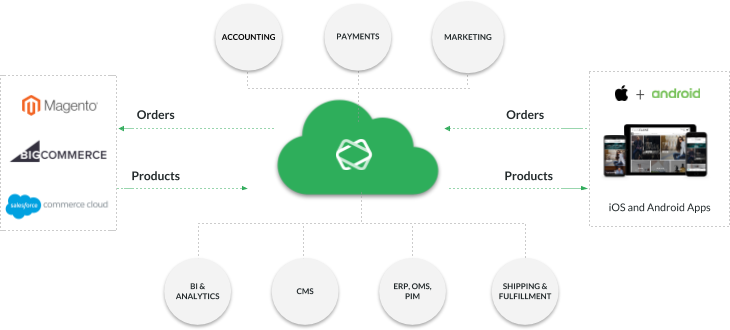

# Commerce Integration

Shopgate CONNECT integrates with many shopping cart systems, allowing merchants to connect their existing online store software to the Shopgate CONNECT platform and to make their products quickly available within an app. On the backend, orders are sent to merchant systems for fulfillment. Shopgate CONNECT also includes services for providing content, engaging users, and analyzing success.

The Shopgate CONNECT platform includes the following components:

* Extendable shopping app themes for iOS and Android
* Preconfigured pipelines for all major commerce workflows
* Comprehensive backend infrastructure
* Flexible integrations with many shopping cart systems

>**Next:**
>
>[Set up your developer environment](../getting-started/set-up-environment.md)

