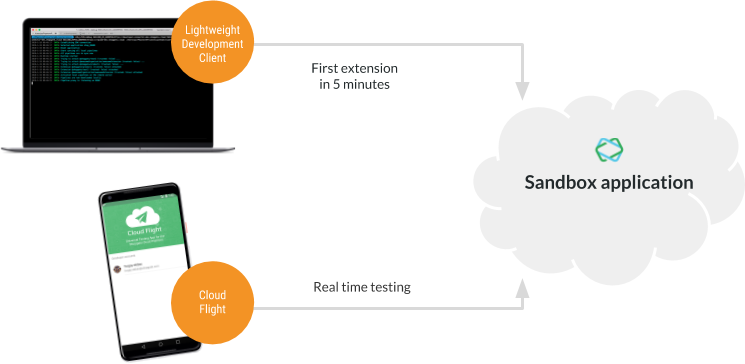

# Development Process

Follow these steps to develop on the Shopgate CONNECT platform:

1. Register as a developer in the Developer Center.
2. Create a new developer organization or join an existing organization. A Shopgate Partner Manager will review your application and enable your accounts. You receive an email when your accounts are enabled.
3. Create sandbox apps for your development.

The CONNECT platform SDK helps you to develop extensions and themes on your local computer. It comes with a lightweight command line tool to set up your environment, enable pipeline step execution locally and test the theme within the browser.

The Cloud Flight testing app provides a convenient way to test any deployed or locally running application on a native device. This functionality works for staging deployments and simplifies the release process.

>**Next:**
>
>[Commerce Integration](commerce-integration.md)
