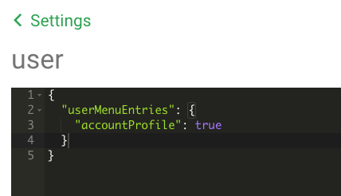

# Tutorial: How to Perform an Advanced ECP Integration

This tutorial shows you how to perform an advanced integration of an e-commerce platform (ECP) to Shopgate Connect. Follow these steps to sync user core data, address data, and the favorites list.

## Prerequisites

You must complete the [Web Checkout integration](../../guides/commerce/webcheckout/overview.md) before performing an advanced integration.

The advanced ECP integration includes the following parts:

*   Syncing user core data
*   Syncing address data
*   Syncing the favorites list

## Syncing user core data

The user can select **My Account** to see and change their core data. Core data includes e-mail, password, and first/last name. Follow these steps to sync changes the user makes to their core data.

### Set up a Form

Deploy the **@shopgate/user** extension, then go to the merchant admin and configure that extension. Use the Form Manager to add the menu entry .

```json
{
  "userMenuEntries": {
    "accountProfile": true
  }
}
```

It should look like this:



### Implement Pipelines

Implement the following pipelines: [getUser](../../../static/pipelines/shopgate-user-pipelines.oas2.yml/paths/~1shopgate.user.getUser.v1/post), [updateUser](../../../static/pipelines/shopgate-user-pipelines.oas2.yml/paths/~1shopgate.user.updateUser.v1/post), [updateMail](../../../static/pipelines/shopgate-user-pipelines.oas2.yml/paths/~1shopgate.user.updateMail.v1/post), [updatePassword](../../../static/pipelines/shopgate-user-pipelines.oas2.yml/paths/~1shopgate.user.updatePassword.v1/post).


### Examples

Take a look at the [Magento](https://github.com/shopgate/ext-magento-user) user extensions on github to see an implementation example . Notice that the files in the _pipelines_ directory each overwrite a pipeline and reference the new implementation files in the _extension_ directory.

For example, the Magento [updateUser pipeline](https://github.com/shopgate/ext-magento-user/blob/v1.3.0/pipelines/shopgate.user.updateUser.v1.json#L37) contains the path to the updateUser.js [file](https://github.com/shopgate/ext-magento-user/blob/v1.3.0/extension/user/updateUser.js). This file defines the user core data inputs. The input values are mapped in that file to fit the API and a request is sent to update the Magento user data to match the Shopgate Connect data.

## Syncing address data

The user can select **My Account** to see and change their billing and shipping addresses. Here,  the user can create, update, or delete addresses. Follow these steps to sync changes the user makes to their addresses. 

### Set up a Form

Configure the **@shopgate/user** extension in the merchant area. Add accountProfile to the userMenuEntries. Configure which addressDefaultGroups your shopsystem supports and which fields the address form requires. 

Here is an example JSON:

```json
{
  "addressDefaultGroups": [
    "shipping",
    "billing"
  ],
  "userMenuEntries": {
    "addressBook": true,
    "accountProfile": true
  },
  "addressForm": {
    "fields": {
      "city": {
        "type": "text",
        "label": "* City",
        "visible": true,
        "required": true,
        "sortOrder": 7
      },
      "custom": {
        "telephone": {
          "type": "phone",
          "label": "* Phone Number",
          "visible": true,
          "required": true,
          "sortOrder": 10
        }
      },
      "country": {
        "type": "country",
        "label": "* Country",
        "default": "US",
        "visible": true,
        "required": true,
        "countries": [
          "DE",
          "US",
          "AT",
          "FR",
          "GB"
        ],
        "sortOrder": 8
      },
      "street1": {
        "type": "text",
        "label": "* Address",
        "visible": true,
        "required": true,
        "sortOrder": 4
      },
      "street2": {
        "type": "text",
        "label": "Address 2",
        "actions": [
          {
            "type": "setVisibility",
            "rules": [
              {
                "data": [
                  ""
                ],
                "type": "notIn",
                "context": "street1"
              }
            ]
          }
        ],
        "required": false,
        "sortOrder": 5
      },
      "zipCode": {
        "type": "text",
        "label": "* Zip",
        "visible": true,
        "required": true,
        "sortOrder": 6
      },
      "lastName": {
        "type": "text",
        "label": "* Last Name",
        "visible": true,
        "required": true,
        "sortOrder": 3
      },
      "province": {
        "type": "province",
        "label": "State",
        "actions": [
          {
            "type": "setVisibility",
            "rules": [
              {
                "data": [
                  "US",
                  "DE",
                  "FR",
                  "GB"
                ],
                "type": "oneOf",
                "context": "country"
              }
            ]
          }
        ],
        "required": true,
        "sortOrder": 9
      },
      "firstName": {
        "type": "text",
        "label": "* First Name",
        "visible": true,
        "required": true,
        "sortOrder": 1
      }
    }
  }
}
```

### Implement Pipelines

Implement the following pipelines: [getAddresses](../../../static/pipelines/shopgate-user-pipelines.oas2.yml/paths/~1shopgate.user.getAddresses.v1/post), [addAddress](../../../static/pipelines/shopgate-user-pipelines.oas2.yml/paths/~1shopgate.user.addAddress.v1/post), [updateAddress](../../../static/pipelines/shopgate-user-pipelines.oas2.yml/paths/~1shopgate.user.updateAddress.v1/post), [deleteAddresses](../../../static/pipelines/shopgate-user-pipelines.oas2.yml/paths/~1shopgate.user.deleteAddresses.v1/post).

### Examples

Look at the [Magento](https://github.com/shopgate/ext-magento-user) & Shopify user extensions on github to see an implementation example. Notice that  the files in the _pipelines_ directory  each overwrite a pipeline and reference the new implementation files in the _extension_ directory.

For example, the Magento [updateAddress pipeline](https://github.com/shopgate/ext-magento-user/blob/v1.3.0/pipelines/shopgate.user.updateAddress.v1.json#L89) contains the path to the buildMagentoAddress.js [file](https://github.com/shopgate/ext-magento-user/blob/v1.3.0/extension/user/address/buildMagentoAddress.js). This file formats the address data to fit the API. Afterwards, as defined in the updateAddress pipeline, the updateAddress.js [file](https://github.com/shopgate/ext-magento-user/blob/v1.3.0/extension/user/address/updateAddress.js) executes, which sends the request to update the Magento user data to match the Shopgate Connect data. 


## Syncing the favorites list

The user can add any product to their favorites list from the product detail page, category page, or search results. The user can access a list of all the products they have favorited. By default, the list is only saved at Shopgate Connect and synced across the apps, but it is not synced with the online store. Follow these steps to sync the favorites list with the online store. 

### Implement Pipelines

Overwrite the following pipelines: [getFavorites](../../../static/pipelines/shopgate-favorites-pipelines.oas2.yml/paths/~1shopgate.user.getFavorites.v1/post), [addFavorites](../../../static/pipelines/shopgate-favorites-pipelines.oas2.yml/paths/~1shopgate.user.addFavorites.v1/post), [deleteFavorites](../../../static/pipelines/shopgate-favorites-pipelines.oas2.yml/paths/~1shopgate.user.deleteFavorites.v1/post), [putFavorites](../../../static/pipelines/shopgate-favorites-pipelines.oas2.yml/paths/~1shopgate.user.putFavorites.v1/post).

The default pipelines read/write the favorite data to Shopgate Connect. The goal is to overwrite these pipelines and to read/write this data directly from/to the shop system. Thus, when the user opens the favorites list in the app, the getFavorites pipeline makes a request to the shop system and fetches the most recent list of products on this user's favorites list. When the user adds a product to the favorites list in the app, the addFavorites pipeline calls the shop system directly, and the product is added to the favorites list.

### Examples

Take a look at the [Magento Favorites Extension](https://github.com/shopgate/ext-magento-favorites) on github to see an implementation example. Notice that the files in the _pipelines_ directory each overwrite a pipeline and reference the new implementation files in the _extension_ directory.

For example, the Magento [addFavorites pipeline](https://github.com/shopgate/ext-magento-favorites/blob/master/pipelines/shopgate.user.addFavorites.v1.json) calls the new pipeline [addFavoriteData](https://github.com/shopgate/ext-magento-favorites/blob/master/pipelines/shopgate.user.addFavoriteData.v1.json). This pipeline contains the path to the addItems.js [file](https://github.com/shopgate/ext-magento-favorites/blob/master/extension/lib/magento/customer/addItems.js), which sends the product data, so that the favorites data in Magento matches the data in Shopgate Connect.