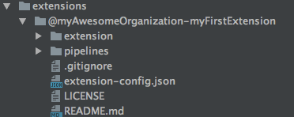

# Create the "Hello World" extension

To start our first extension we need to create the basic extension structure including all folders and configuration files. This can be done with the sgconnect application.

## Create a New Extension
Create a new extension using sgconnect. 

1. Open a terminal
2. Navigate to the application folder which was created in the tutorial [Setup your environment](markdown/introduction/getting-started/set-up-environment.md)
3. run `sgconnect extension create`
4. When asked about the type of extension you plan on creating deselect frontend and leave backend selected. Press enter
5. Enter the name `@myAwesomeOrganization/myFirstExtension` as the extension name
6. When asked if the extension needs to run in a trusted environment select `no`. Trusted environments will be explained in later tutorials.

The SDK will create the basic structure of our "Hello World" extension in the `extensions` folder.

> The extension name is made up of  an at sign (`@`), the organization id that was assigned in the previous tutorial ([Setup your environment](markdown/introduction/getting-started/set-up-environment.md)) a slash (`/`) and a name specific to the extension. In this tutorial we use the placeholder id `myAwesomeOrganization` as our organization. You should replace this with your organization id also in the further steps.

### Folder structure

Your extension folder should look like the folder pictured below:

| Name | Description   |
|---|---|
| **/extension** | This folder contains all js files which can be executed by the backend server. It can contain node modules, simple js file or step files which  are used in a pipeline.   |
| **/pipelines**  | This folder contains all the pipelines which are defined by this extension. We will come to this in more detail later.   |
| **/frontend**| This folder contains all frontend components of the extension. This folder is used in further tutorials |
| **/extension-config.json**  |  This JSON file contains all configuration values of the extension like name, version or settinge for the runtime.  |
