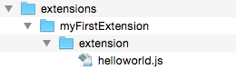
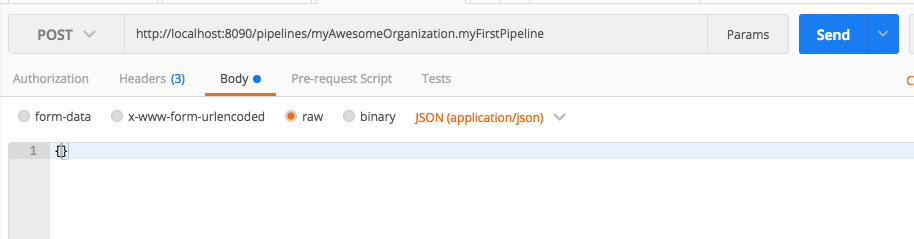
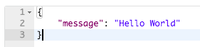

## Build our first pipeline

Now that we created the folder structure we can move on to the next topic: The real coding.
In this tutorial we want to learn how to write a step and how to include it in a pipeline.

The goal of this step is to have a pipeline called `myAwesomeOrganization.myFirstPipeline` which returns the static string `Hello World`.

Please keep in mind that the name of the pipeline consists out of two parts: The first part is the organisation id which was created in the step ["Setup environment"](markdown/introduction/getting-started/set-up-environment.md).
The second part can be every string.

### Create the step

To create output we need a snippet which just returns an object with the property `message` which has the value `Hello World`.

Every step that we write needs to go in the folder `extension` which is in the extensions folder.

So let's start with our first step called `helloWorld.js`. We need create this in `extensions/myFirstExtension/extension/helloWorld.js`.

So our folder structure should look like this:



After adding the file we need to put our code in this file.

Every step file needs to export a function with the following parameter:

| Name | Type | Description   |
|---|---|---|
| **context** | Object | Contains all meta information,  functions to access the storage and many more. For more details [see here](/references/connect/extensions/steps). |
| **input** | Object | The input of the step. We will come to this later in this tutorial |

The function needs to return an object which contains all information that you want to expose to the pipeline.

Below is the basic structure of a step function. Let's copy it over to our `helloWorld.js` file.

```js
module.exports = async (context, input) => {
  return {}
}
```
Now that we have the basic structure of a step we can add code to it. Our goal is to output the message `Hello World`.

To do this we have to pass the message as a property of an object as the second parameter of the callback. Since we don't have an error here we can set the first parameter to null.

```js
module.exports = async (context, input) => {
  const message = 'Hello World'
  return { message: message }
}
```

### Integrate Our Step in a Pipeline

Yay! We wrote our first step. But currently it's kind of useless because no pipeline calls it.

So let's move on to the next part. Let's integrate our step into a pipeline.

When we navigate to the folder `/extensions/myFirstExtension/pipelines` 

Create a file name `myAwesomeOrganization.myFirstPipeline.json` in the pipelines folder.  

Add the content below to the file.

```json
{
  "version": "1",
  "pipeline": {
    "id": "myAwesomeOrganization.myFirstPipeline",
    "public": true,
    "input": [],
    "output": [],
    "steps": []
  }
}
```

The pipeline file has a fixed structure. In this tutorial we will only show one config possibility. For more information please visit the reference page.

Move on! Now we can integrate our step into this pipeline.
The pipeline json contains a property called `steps`.

This array includes all the steps and their configuration in the order that they should be executed when the pipeline is called.

Now we want to call our `helloWorld` step. Copy the json from below into the file.

```json
{
  "version": "1",
  "pipeline": {
    "id": "myAwesomeOrganization.myFirstPipeline",
    "public": true,
    "input": [],
    "output": [
      {
        "key": "message",
        "id": "1"
      }
    ],
    "steps": [
      {
        "type": "extension",
        "id": "@myAwesomeOrganization/myFirstExtension",
        "path": "@myAwesomeOrganization/myFirstExtension/helloWorld.js",
        "input": [],
        "output": [
          {
            "key": "message",
            "id": "1"
          }
        ]
      }
    ]
  }
}
```

### Test

Awesome! We created our first pipeline! Let's move on to the question: How can we test it?

#### Run local environment

In the production system all steps run in an isolated container. This makes it difficult to develop and debug our code. To make it easy for every developer the SDK includes a special runtime which let us execute the step locally.

To start this runtime we need to do the following steps:
1. Execute `sgconnect extension attach` to attach all extensions to the runtime
2. Start the runtime with `sgconnect backend start`

Sgconnect will automatically sync the extensions pipeline folder to the main pipeline folder. 

#### Trigger 

In the production system the app is communicating with Shopgate Connect via a high-performance channel. To emulate this communication the SDK contains a proxy. It can be called with a normal REST call to trigger a pipeline.

Let's try it out. First of all we need to open a REST client. We recommand [Postman](https://www.getpostman.com/).

Set up the request:
* Method: **POST**
* URL: **http://localhost:8090/pipelines/myAwesomeOrganization.myFirstPipeline**
* Body-type: **JSON (application/json)**
* Request Body: `{}`

*Postman Post Setting*



After sending the request you should see the following output:

*Expected Response*


