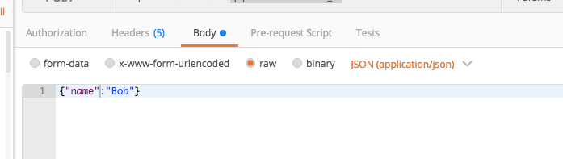
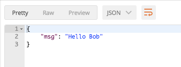

# Modify Existing Pipeline

Right now the pipeline only responds with "Hello World" which isn't very interesting. Let's customize the message with an input value. The "Hello World" message would be changed to "Hello Bob" or "Hello Sally" depending on the input.

There are two ways to do this:
1. Adapt the first step and just concatenate both strings together
2. Add another pipeline step which retrieves the message "Hello World" from the first step, input from the pipeline, and replaces the word "World" with the input.

In practice there are some use cases where you have fixed steps and you are only able to manipulate the result of them with an additional step. So let's go for the second possibility.

## Pipeline structure and the "shared object"

Before we can start with the manipulation we need to understand how a pipeline and a pipeline execution works.

The concept of a pipeline is very simple. Every step gets executed one after another in series. To make the managing of inputs/outputs very easy every pipeline has a mechanism which is called the "shared object".

On every pipeline execution an object is created. In the first step all inputs of the pipeline get written into it. When a step gets executed it can use some of the properties and it can also add some. We can also define in the pipeline file which property should be exposed as a response. This makes the pipelines very flexible.

## Add "Replacer"

Add the name input to the pipeline's input array.
```json
{
  "key": "name",
  "id": "10"
}
```
Add another step to the pipeline by adding the code below to the end of the pipeline steps array.

```json
{
  "type": "extension",
  "id": "@myAwesomeOrganization/myFirstExtension",
  "path": "@myAwesomeOrganization/myFirstExtension/putNameIntoMessage.js",
  "input": [
    {
      "key": "name",
      "id": "10"
    },
    {
      "key": "message",
      "id": "1"
    }
  ],
  "output": [
    {
      "key": "message",
      "id": "1"
    }
  ]
}
```

After these two edits your `myFirstPipeline.json` file should look like the example below.

```json
{
  "version": "1",
  "pipeline": {
    "id": "myAwesomeOrganization.myFirstPipeline",
    "public": true,
    "input": [
      {
        "key": "name",
        "id": "10"
      }
    ],
    "output": [
      {
        "key": "msg",
        "id": "1"
      }
    ],
    "steps": [
      {
        "type": "extension",
        "id": "@myAwesomeOrganization/myFirstExtension",
        "path": "@myAwesomeOrganization/myFirstExtension/helloWorld.js",
        "input": [],
        "output": [
          {
            "key": "message",
            "id": "1"
          }
        ]
      },
      {
        "type": "extension",
        "id": "@myAwesomeOrganization/myFirstExtension",
        "path": "@myAwesomeOrganization/myFirstExtension/putNameIntoMessage.js",
        "input": [
          {
            "key": "name",
            "id": "10"
          },
          {
            "key": "message",
            "id": "1"
          }
        ],
        "output": [
          {
            "key": "message",
            "id": "1"
          }
        ]
      }
    ]
  }
}
```

## Add a JS file for the new pipeline step

In the extension directory create a new file called `putNameIntoMessage.js`. Notice this corresponds to the path used in the second step of the pipeline. Add the code below to the file.

```js
// putNameIntoMessage.js
module.exports = async (context, input) => {
    const message = input.message.replace("World", input.name)
    return { message: message }
}
```

## Test

You will use the same setting in your rest client as you did for the first test with the exception of the object passed in the request body. This time instead of an empty object pass an object with a property called name and the value of Bob. 

* Method: **POST**
* URL: **http://localhost:8090/pipelines/myAwesomeOrganization.myFirstPipeline**
* Request Body: `{"name":"Bob"}`



The expected output should look similar to what is pictured below.


