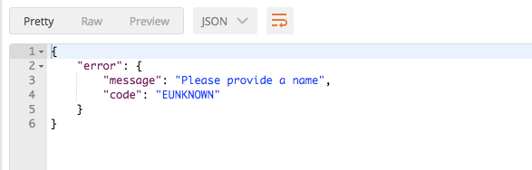
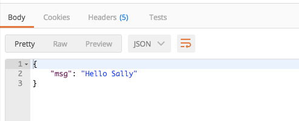

## Using optional input, storing data, and using stored data

Now we are going to expand this functionality by storing the name passed to the pipeline for later use. This will allow us to make the name input optional. If the name input is available in the request the pipeline will use it to customize the Hello World message and save it. If it is not available the pipeline will look for a saved name and use that to customize the `Hello World` message. If the name is not available in the request, and not stored the pipeline will throw an error.

### Making input optional by editing pipeline configuration (helloWorld_v1.json)

To make input optional the pipeline configuration found in the helloWorld.json file must be edited. To do this add the optional property to the input object and make its value true. This must be done to the pipelines input, and the name input of the second step. So the input objects will go from  `{"key": "name", "id" : "10"}` to  `{"key": "name", "id" : "10", "optional": true}`. After the two edits the helloWorld.json file will look like the one below.

**myAwesomeOrganization.myFirstPipeline.json**

```json
{
  "version": "1",
  "pipeline": {
    "id": "myAwesomeOrganization.myFirstPipeline",
    "public": true,
    "input": [
      {
        "key": "name",
        "id": "10",
        "optional": true
      }
    ],
    "output": [
      {
        "key": "msg",
        "id": "1"
      }
    ],
    "steps": [
      {
        "type": "extension",
        "id": "@myAwesomeOrganization/myFirstExtension",
        "path": "@myAwesomeOrganization/myFirstExtension/helloWorld.js",
        "input": [],
        "output": [
          {
            "key": "message",
            "id": "1"
          }
        ]
      },
      {
        "type": "extension",
        "id": "@myAwesomeOrganization/myFirstExtension",
        "path": "@myAwesomeOrganization/myFirstExtension/putNameIntoMessage.js",
        "input": [
          {
            "key": "name",
            "id": "10",
            "optional": true
          },
          {
            "key": "message",
            "id": "1"
          }
        ],
        "output": [
          {
            "key": "message",
            "id": "1"
          }
        ]
      }
    ]
  }
}
```
### Edit putNameIntoMessage.js file to use name input or saved name

Replace the existing code in the putNameIntoMessage.js file with the code below.

**putNameIntoMessage.js**
```js
module.exports = async (context, input) => {
  if (input.name) {
    await context.storage.device.set('name', input.name)
    const message = nameManipulation(input.message, input.name)
    return { message }
  }

  const name = await context.storage.device.get('name')
  if (!name) throw new Error('Please provide a name')

  context.log.debug('Name was provided by storage')
  return { message: nameManipulation(input.message, name) }
}

/**
 * @param {string} base base string to replace
 * @param {string} name name to replace
 */
function nameManipulation (base, name) {
  return base.replace('World', name)
}
```


### The context object

The context.storage object allows a pipeline step to save data, and retrieve saved data. The context.storage has three sub-objects extension, device, and user.

**context.storage.extension**
* extension is always available.
* Data stored here is available in this extension whenever it is run.

**context.storage.device**
* device is always available
* Data stored here is specific to the end user device the pipeline is accessed from

**context.storage.user**
* user is only available when a user is logged in on the end user device
* Data stored here is specific to the user regardless of what device that user is using 

#### get(), set(), del() methods
extension device and user all have the methods get(), set() and del().

**get(key)**
* Used to retrieve data from storage.
* It expects the parameter key which contains the name of the property the data being retrieved is stored in.
* The function returns a promise which resolves on success with the value or rejects with an error.
example: `const name = await context.storage.extension.get("name");`

**set(key, value)**
* Used to add data to storage.
* It expects 2 parameters key and value
* key is a string that contains the name of the property the data will be saved in.
* value is the value (of any type like number, string, array, ...) of the data to be saved.
* The function returns a promise which resolves on success or rejects with an error.
example: `await context.storage.device.set("name", "Bob")`

**del(key)**
* Used to delete data from storage.
* It expects the parameters key which contains  the name of the property to be deleted.
* The function returns a promise which resolves on success or rejects with an error.
example: `await context.storage.user.del("isNewCustomer")`

### Test

First let's see what the error will look like. Send a request with an empty object in the request body.

* Method: **POST**
* URL: **http://localhost:8090/pipelines/myAwesomeOrganization.myFirstPipeline**
* Request Body: `{}`

The output will look similar to what is below.



An error is reported because the pipeline couldn't find the name from either input or storage. 

Now add the a name to the input passed to the pipeline. To do this add an object to the body request that includes the property name with the value `Sally`.

* Method: **POST**
* URL: **http://localhost:8090/pipelines/myAwesomeOrganization.myFirstPipeline**
* Request Body: `{"name":"Sally"}`

The output will look similar to what is below.



This time pass an empty object. The name should be found in storage.

* Method: **POST**
* URL: **http://localhost:8090/pipelines/myAwesomeOrganization.myFirstPipeline**
* Request Body: `{}`

The response should look like what is below.


