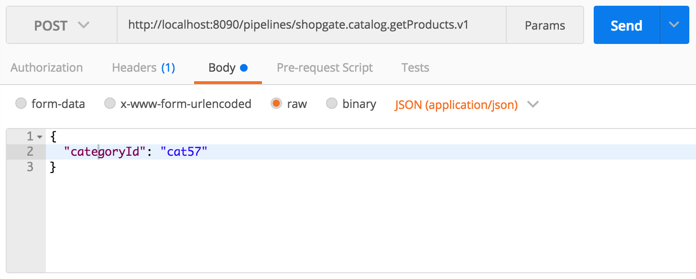
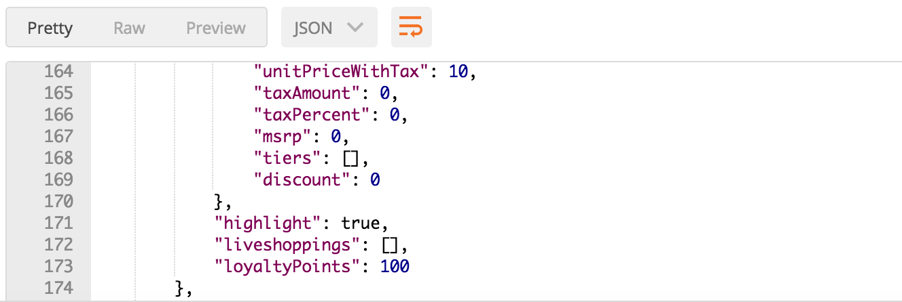
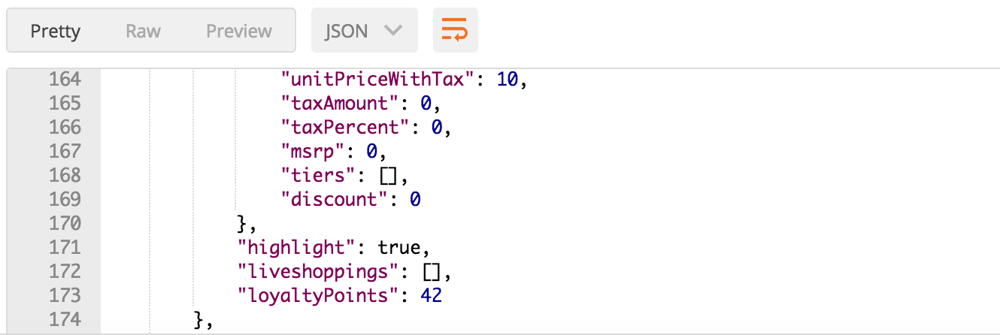

# Tutorial -- Loyalty Points Backend

You can use this tutorial to create a new Shopgate Connect extension that adds an additional property to the standard product response. In this tutorial, the additional property represents the number of loyalty points a customer can earn by buying a specific product. You will extend the existing `shopgate.catalog.getProducts.v1` and `shopgate.catalog.getProduct.v1` pipelines.

> **Prerequisites:**
>
> Before starting this tutorial, complete the Shopgate [Getting Started](markdown/introduction/index.md) instructions.

## Create the Loyalty Point Extension

Use the `sgconnect` command to create the basic extension structure, including all directories and configuration files.

### Create a New Extension

Create a new extension using `sgconnect`:

1. Open a terminal.
2. Navigate to the application directory that was created in the introduction [Setup your environment](markdown/introduction/getting-started/set-up-environment.md)
3. Run `cd extensions/` to navigate to the extensions directory of the application.
4. Run `sgconnect extension create`.
5. When prompted for the extension type, leave `frontend` and `backend` selected. Press Enter.
6. Enter the name `@myAwesomeOrganization/loyaltyPoints`. The extension name has the following format: `@{organizationId}/{extensionId}`.
7. When prompted about running the extension in a trusted environment, select no. Refer to this [guide on pipelines](markdown/guides/technical/connect/pipelines.md) to learn more about trusted environments.

## Create the Extension File

Now you can create the step that adds the loyalty points. For simplicity, add a static number of loyalty points, such as `100`, for all products. For the input, you get an array of products. For the output, you also return an array of products. The corresponding code should iterate through the products and add the loyalty points.

Here is an example:

```javascript
// ./extensions/@myAwesomeOrganization-loyaltyPoints/extension/loyaltyPoints/addLoyaltyPoints.js

module.exports = async (context, input) => {
  const products = input.products.map((product) => {
    product.loyaltyPoints = 100
    return product
  })
  return {'products': products}
}
```

### Alter the Extension Config File

To learn more about the automatic step insertion concept Shopgate Connect supports, navigate to the [automatic step insertion guide](markdown/guides/technical/connect/step-insertion.md).

To alter the Extension Config File, you must introduce the to-be-hooked step to your extension. To do so, open the `extension-config.json (./extensions/@myAwesomeOrganization-loyaltyPoints/extension-config.json)` file within your newly created extension and add the following property to the root level of the extension config object.

```json
"steps": [
  {
    "hooks": [
      "shopgate.catalog.getProductsByIds.v1:afterFetchProducts"
    ],
    "path": "extension/loyaltyPoints/addLoyaltyPoints.js",
    "input": [
      {
        "key": "products"
      }
    ],
    "output": [
      {
        "key": "products"
      }
    ]
  }
]
```

By adding these lines to the extension config, a new extension step is added into the `afterFetchProducts` hook of the `shopgate.catalog.getProduct.v1` and `shopgate.catalog.getProductsByIds.v1` pipeline (specified within the hooks property). Also, the input and output properties indicate that the inserted step processes the pipeline's products array.

You may wonder why the step is hooked into these pipelines instead of the `shopgate.catalog.getProducts.v1`. This is because the `getProducts` calls the `getProductsByIds` internally. To learn more about this and extending products in general see the [product extensibility guide](markdown/guides/technical/connect/product-extensibility.md).

This functionality enables you to easily extend a pipeline without copying/overwriting it in your extension.

### Testing Your Sample Code (Run Local Environment)

After you have written the step code and altered the extension config file, you can test your code. In the production system, all steps run in an isolated container. Developing and debugging in the production system is difficult. Instead, you can use the SDK runtime to execute the steps locally.

To start the runtime, complete the following steps:

1. Execute `sgconnect extension attach` to attach all extensions to the runtime.
2. Start the runtime with `sgconnect backend start`.

After the process begins, browse the pipelines directory of your project to locate a directory called `resolved`. This directory contains the `shopgate.catalog.getProductsByIds.v1.json` including the `addLoyaltyPoints.js` step as shown in the code snippet below.

shopgate.catalog.getProductsByIds.v1.json
```json
{
  "version": "1",
  "pipeline": {
    "id": "shopgate.catalog.getProductsByIds.v1",
    "input": [
      {
        "id": "7",
        "key": "productIds"
      },
      {
        "id": "4",
        "key": "offset",
        "optional": true
      },
      {
        "id": "5",
        "key": "limit",
        "optional": true
      },
      {
        "id": "6",
        "key": "sort",
        "optional": true
      },
      {
        "id": "8",
        "key": "skipHighlightLoading",
        "optional": true
      },
      {
        "id": "9",
        "key": "skipLiveshoppingLoading",
        "optional": true
      },
      {
        "id": "15",
        "key": "showInactive",
        "optional": true
      },
      {
        "id": "750",
        "key": "sgxsMeta"
      },
      {
        "id": "751",
        "key": "characteristics",
        "optional": true
      }
    ],
    "steps": [
      {
        "id": "@shopgate/products",
        "path": "@shopgate/products/products/getProducts.js",
        "type": "extension",
        "input": [
          {
            "id": "4",
            "key": "offset",
            "optional": true
          },
          {
            "id": "5",
            "key": "limit",
            "optional": true
          },
          {
            "id": "6",
            "key": "sort",
            "optional": true
          },
          {
            "id": "7",
            "key": "productIds",
            "optional": true
          },
          {
            "id": "15",
            "key": "showInactive",
            "optional": true
          },
          {
            "id": "751",
            "key": "characteristics",
            "optional": true
          }
        ],
        "output": [
          {
            "id": "10",
            "key": "service"
          },
          {
            "id": "11",
            "key": "version"
          },
          {
            "id": "12",
            "key": "path"
          },
          {
            "id": "13",
            "key": "method"
          },
          {
            "id": "14",
            "key": "query"
          }
        ]
      },
      {
        "id": "@shopgate/bigapi",
        "path": "@shopgate/bigapi/big-api/getBigApiResult.js",
        "type": "extension",
        "input": [
          {
            "id": "10",
            "key": "service"
          },
          {
            "id": "11",
            "key": "version"
          },
          {
            "id": "12",
            "key": "path"
          },
          {
            "id": "13",
            "key": "method"
          },
          {
            "id": "14",
            "key": "query"
          }
        ],
        "output": [
          {
            "id": "100",
            "key": "collection"
          },
          {
            "id": "101",
            "key": "meta"
          }
        ]
      },
      {
        "type": "extension",
        "id": "@myAwesomeOrganization/loyaltyPoints",
        "path": "@myAwesomeOrganization/loyaltyPoints/addLoyaltyPoints.js",
        "input": [
          {
            "id": "100",
            "key": "products"
          }
        ],
        "output": [
          {
            "id": "100",
            "key": "products"
          }
        ]
      },
      {
        "id": "@shopgate/products",
        "path": "@shopgate/products/products/updateAvailableText.js",
        "type": "extension",
        "input": [
          {
            "id": "100",
            "key": "products"
          }
        ],
        "output": [
          {
            "id": "100",
            "key": "products"
          }
        ]
      },
      {
        "id": "@shopgate/products",
        "path": "@shopgate/products/products/convertProducts.js",
        "type": "extension",
        "input": [
          {
            "id": "100",
            "key": "products"
          },
          {
            "id": "101",
            "key": "meta"
          }
        ],
        "output": [
          {
            "id": "100",
            "key": "products"
          },
          {
            "id": "301",
            "key": "productsLength"
          },
          {
            "id": "1000",
            "key": "totalProductCount"
          }
        ]
      },
      {
        "id": "@shopgate/products",
        "path": "@shopgate/products/products/addPrices.js",
        "type": "extension",
        "input": [
          {
            "id": "750",
            "key": "sgxsMeta"
          },
          {
            "id": "100",
            "key": "products"
          }
        ],
        "output": [
          {
            "id": "100",
            "key": "products"
          }
        ]
      },
      {
        "id": "@shopgate/products",
        "path": "@shopgate/products/products/formatPrices.js",
        "type": "extension",
        "input": [
          {
            "id": "100",
            "key": "products"
          }
        ],
        "output": [
          {
            "id": "100",
            "key": "products"
          }
        ]
      },
      {
        "else": {
          "id": "shopgate.catalog.addHighlights.v1",
          "type": "pipeline",
          "input": [
            {
              "id": "100",
              "key": "products"
            }
          ],
          "output": [
            {
              "id": "100",
              "key": "products"
            }
          ]
        },
        "then": {
          "type": "staticValue",
          "input": [
            {
              "id": "100",
              "key": "products"
            }
          ],
          "output": [
            {
              "id": "100",
              "key": "products"
            }
          ],
          "values": [
            {
              "key": "products",
              "passthrough": "products"
            }
          ]
        },
        "type": "conditional",
        "input": [
          {
            "id": "8",
            "key": "skipHighlightLoading",
            "optional": true
          },
          {
            "id": "301",
            "key": "productsLength"
          }
        ],
        "expression": {
          "any": [
            {
              "ok": [
                {
                  "name": "skipHighlightLoading",
                  "type": "input"
                }
              ]
            },
            {
              "notok": [
                {
                  "name": "productsLength",
                  "type": "input"
                }
              ]
            }
          ]
        }
      },
      {
        "else": {
          "id": "shopgate.catalog.addLiveshoppings.v1",
          "type": "pipeline",
          "input": [
            {
              "id": "100",
              "key": "products"
            }
          ],
          "output": [
            {
              "id": "100",
              "key": "products"
            }
          ]
        },
        "then": {
          "type": "staticValue",
          "input": [
            {
              "id": "100",
              "key": "products"
            }
          ],
          "output": [
            {
              "id": "100",
              "key": "products"
            }
          ],
          "values": [
            {
              "key": "products",
              "passthrough": "products"
            }
          ]
        },
        "type": "conditional",
        "input": [
          {
            "id": "9",
            "key": "skipLiveshoppingLoading",
            "optional": true
          },
          {
            "id": "301",
            "key": "productsLength"
          }
        ],
        "expression": {
          "any": [
            {
              "ok": [
                {
                  "name": "skipLiveshoppingLoading",
                  "type": "input"
                }
              ]
            },
            {
              "notok": [
                {
                  "name": "productsLength",
                  "type": "input"
                }
              ]
            }
          ]
        }
      }
    ],
    "output": [
      {
        "id": "1000",
        "key": "totalProductCount"
      },
      {
        "id": "100",
        "key": "products"
      }
    ],
    "public": true
  }
}

```

## Trigger

In the production system, the extension communicates with the Shopgate Connect platform through a high-performance channel. To emulate this communication, the SDK contains a proxy. You can call the proxy with a normal REST call to trigger a pipeline.

To set up the trigger, complete the following steps:

1. Open a REST client. Shopgate recommends [Postman](https://www.getpostman.com/).
2. For this test, you need a category ID. The ID can be different depending on the marketplace and the set up. Go to your Shopgate Merchant Admin and navigate to **Products > Categories**.
3. Select an active category and copy the `Category number`.
4. Set up the REST request as follows:

* Method: **POST**
* URL: **http://localhost:8090/pipelines/shopgate.catalog.getProducts.v1**
* Body-type: **JSON (application/json)**
* Request Body: `{"categoryId":"[Insert the category number here]"}`



Now you see the loyalty points in all products of the response.



## Get Loyalty Points from an External Resource

In most use cases, the loyalty points are set up and calculated in an external service. This example uses a simulated loyalty service provider named Shopgate Tutorial Points. This section explains how to create an implementation to access this service.

### Install Dependencies

In the next step, the static value is replaced with a loyalty points from the external service.

To create a request easily and to parallelize the requests, you can use the request helper library `request-promise` and the promise helper library `bluebird`.

To install dependencies, complete the following steps:

1. Navigate to the extension directory: `cd extensions/@myAwesomeOrganization-loyaltyPoints/extension`.
2. Install the modules: `npm install request request-promise bluebird`.

### Implement the Request

Now you can include both modules in the step.

With the `request-promise` library, you can create a request to the service. To get loyalty points for the specific product, you must pass the product ID as a query string.

The `Array.map` function, which you used for the static value, works only for synchronous calls. You can use the bluebird library to use the map method in the context of a promise.

Here is an example of implementing the request:

```js
// ./extension/loyaltyPoints/addLoyaltyPoints.js

const request = require('request-promise')
const Promise = require('bluebird')

module.exports = async (context, input) => {
  const products = await Promise.map(input.products, async (product) => {
    const result = await requestLoyaltyPoints(product.id)
    product.loyaltyPoints = result.loyaltyPoints
    return product
  })

  return {products}
}

function requestLoyaltyPoints (productId) {
  const options = {
    url: 'https://data.shopgate.com/tutorials/loyaltyPoints.json',
    qs: { productId },
    json: true
  }
  return request(options)
}
```

### Test the Implementation

To test the new implementation, call the pipeline again with the same parameter as in the step before.

Set up the REST request as follows:

* Method: **POST**
* URL: **http://localhost:8090/pipelines/shopgate.catalog.getProducts.v1**
* Body-type: **JSON (application/json)**
* Request Body: `{"categoryId":"[Insert the category number here]"}`

Now the `loyaltyPoints` property value is 42 for every product.




## The getProduct.v1 Pipeline
If you test the code against `getProduct.v1` you will notice the output for loyaltyPoints is missing.

This is because the pipeline has a fieldlist like output map:

```
"output": [
    {
        "id": "100",
        "key": "id"
    },
    {
        "id": "101",
        "key": "name"
    },
    {
        "id": "104",
        "key": "manufacturer"
    },
    // ...
]
```

To make our hook work with that pipeline, we need to add another step to our `extension-config.json`:
```json
"steps": [
    {
        "hooks": [
            "shopgate.catalog.getProductsByIds.v1:afterFetchProducts"
        ],
        "path": "extension/loyaltyPoints/addLoyaltyPoints.js",
        "input": [
            {
                "key": "products"
            }
        ],
        "output": [
            {
                "key": "products"
            }
        ]
    },
    {
        "hooks": [
            "shopgate.catalog.getProduct.v1:afterFetchProducts"
        ],
        "path": "extension/loyaltyPoints/addLoyaltyPointsOutput.js",
        "input": [
            {
                "key": "products"
            }
        ],
        "output": [
            {
                "key": "loyaltyPoints",
                "addPipelineOutput": true
            },
            {
                "key": "products"
            }
        ]
    }
]
```

Notice the `addPipelineOutput` flag in the step. 

Implementation of `extension/loyaltyPoints/addLoyaltyPointsOutput.js`:
```javascript
module.exports = async (context, input) => {
  const { products } = input
  let { loyaltyPoints } = products[0]

  return { products, loyaltyPoints }
}
```
